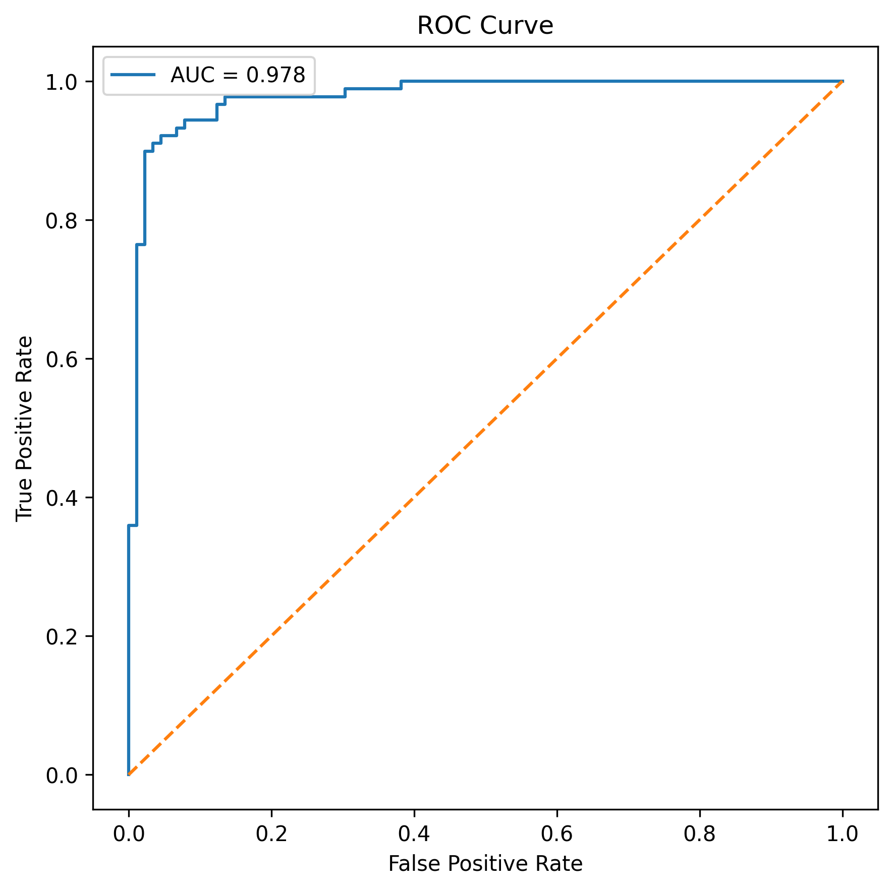
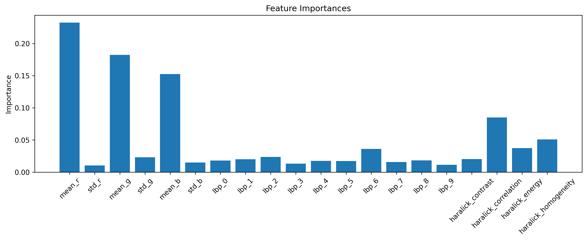

# Histopathology Image Classification using Classical Machine Learning


Classical machine learning pipeline for Oral Squamous Cell Carcinoma (OSCC) histopathology image classification using handcrafted texture and color features.

The project compares:
- Random Forest vs SVM
- different handcrafted feature combinations
- balanced vs imbalanced datasets
- 100x vs 400x magnification
- SVM with and without feature scaling

Features used:
- RGB color statistics
- Local Binary Pattern (LBP)
- Haralick texture features

# Dataset
- [Histopathological imaging database for Oral Cancer analysis](https://data.mendeley.com/datasets/ftmp4cvtmb/2)
- DOI: `10.17632/ftmp4cvtmb.2`

Details:
- H&E stained tissue slides
- 230 patients
- Binary classification:
  - Normal tissue
  - OSCC tissue

Magnifications used:
- 100x
- 400x

# Pipeline

## Preprocessing
- resize images to `512×512`
- grayscale conversion
- Otsu thresholding
- morphological cleanup
- tissue/background separation

## Feature Extraction
- RGB mean and standard deviation
- LBP histogram features
- Haralick texture features

## Models
- Random Forest
- SVM (RBF kernel)

## Training
- repeated stratified cross-validation
- GridSearchCV hyperparameter tuning
- fixed random seeds for reproducibility

## Evaluation Metrics
- Accuracy
- AUC
- PR-AUC
- Precision
- Sensitivity
- Specificity
- F1-score
- MCC
- Brier score

Statistical analysis:
- corrected paired t-test
- Wilcoxon signed-rank test
- Welch’s t-test
- Mann–Whitney U test
- Cohen’s d

# Installation
- Clone Repository: 
    - ```git clone https://github.com/yourusername/oral-cancer-histopathology-ml.git```
    - ```cd oral-cancer-histopathology-ml```
- Create virtual env: ```python -m venv venv```
- Activate venv:
    - Windows: ```venv\Scripts\activate```
    - Linux/Mac: ```source venv/bin/activate```
- Install dependencies: ```pip install -r requirements.txt```
- Run experiment: ```python train_model.py```
- Run statistical analysis: ```python stats_analysis.py```
- Experiment configs: ```experiments.py```

# Results

## Best Configuration
| Model | Features | Magnification | Accuracy | AUC |
|---|---|---|---|---|
| SVM | Haralick | 100x | 0.947 | 0.986 |

## Sample ROC Curve


## Sample Feature Importance Plot


# Main Findings
- SVM generally performed better than Random Forest
- 100x images performed better than 400x
- feature scaling improved SVM stability
- Haralick features improved some configurations
- dataset imbalance reduced specificity
- small datasets produced unstable results in some experiments

# Outputs
Each experiment saves:
- metrics
- fold predictions
- ROC/PR curves
- confusion matrices
- calibration plots
- feature importance plots
- experiment configs

# Limitations
- no patient-wise splitting available
- dataset imbalance
- single-source dataset
- no external validation dataset
- handcrafted features cannot capture all tissue morphology patterns
- possible hidden patient-level leakage due to image-level splitting

---
### *If you use this project, please cite the original dataset creators.*
---

Date Updated: <!--LAST_UPDATED--> 22-05-2026
