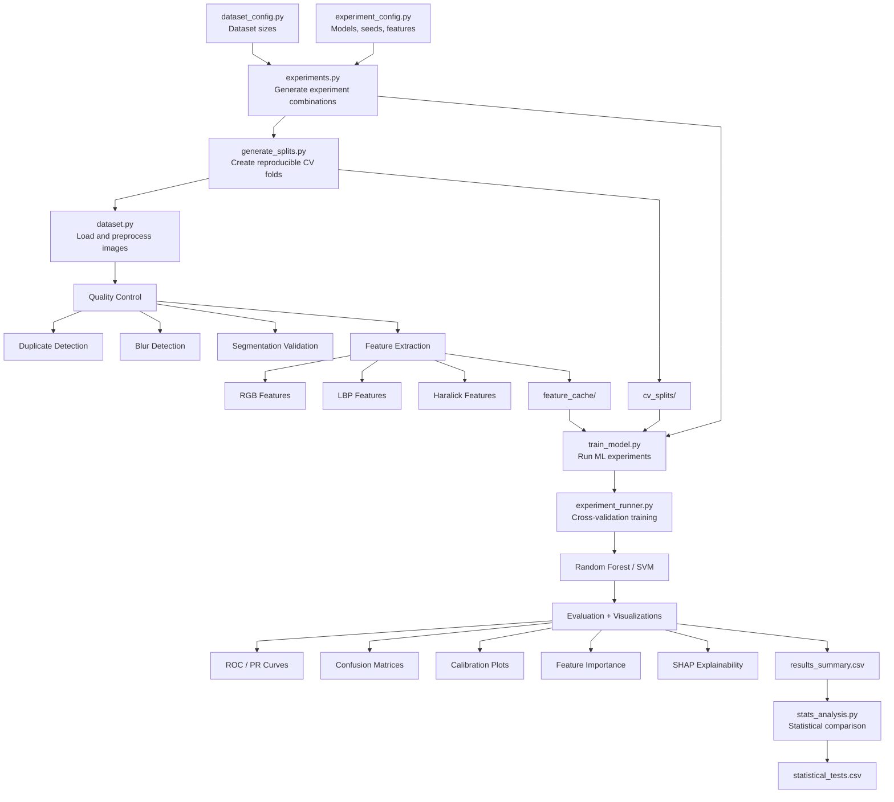
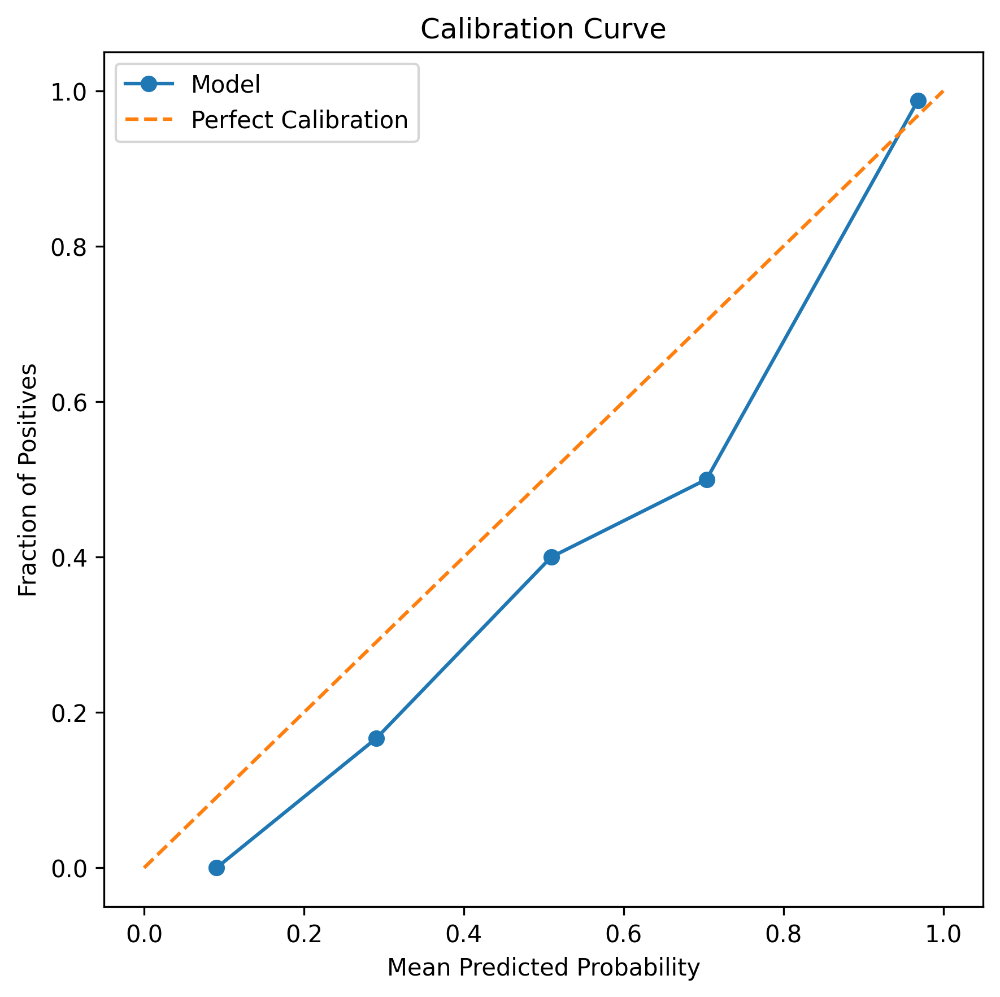

# Histopathology Image Classification using Classical Machine Learning


Classical machine learning research pipeline for Oral Squamous Cell Carcinoma (OSCC) histopathology image classification using handcrafted texture and color descriptors.

This repository focuses on building a reproducible and rigorously evaluated computational pathology baseline before transitioning toward deep learning approaches.

## Research Objective
This project investigates whether handcrafted histopathological image descriptors can effectively classify Oral Squamous Cell Carcinoma (OSCC) tissue images across different microscopic magnifications.

The study evaluates:
- handcrafted feature engineering strategies
- stain normalization effects
- feature scaling effects
- Random Forest vs SVM performance
- balanced vs imbalanced dataset behavior
- dataset size sensitivity
- model robustness across magnifications
- reproducibility and variance across experimental conditions

The long-term objective is to establish strong classical ML baselines before transitioning to deep learning and domain generalization experiments.

## Summary
| Category              | Best Configuration                                | Key Result             |
| --------------------- | ------------------------------------------------- | ---------------------- |
| Best Overall          | `svm_scaled_all_no_norm_full_100x_seed_42`        | AUC ~0.986             |
| Best RF               | `rf_unscaled_haralick_reinhard_full_100x_seed_42` | F1 ~0.92               |
| Best Magnification    | 100x                                              | Consistently strongest |
| Best Feature Strategy | Combined handcrafted descriptors                  | Highest discrimination |
| Best Dataset Regime   | Full dataset                                      | Lowest variance        |


## Dataset
- [Histopathological imaging database for Oral Cancer analysis](https://data.mendeley.com/datasets/ftmp4cvtmb/2)
- DOI: `10.17632/ftmp4cvtmb.2`

Details:
- H&E stained tissue slides
- 230 patients
- Binary classification:
  - Normal tissue
  - OSCC tissue

Magnifications used:
- 100x
- 400x

## Experiment Scale

The current pipeline includes:
- 300+ completed experiments
- repeated stratified cross-validation
- multiple dataset sizes
- handcrafted feature combination benchmarking
- stain normalization comparisons
  - no normalization
  - Reinhard normalization
  - Macenko normalization
- scaling vs non-scaling comparisons
- Random Forest and SVM benchmarking
- calibration analysis
- learning curve analysis
- statistical significance testing

Each experiment automatically stores:
- fold-level metrics
- fold predictions
- best hyperparameters
- experiment configuration metadata
- confusion matrices
- ROC curves
- PR curves
- calibration plots
- feature importance outputs
- SHAP explainability outputs

## Pipeline


## Preprocessing Pipeline

Implemented preprocessing operations:
- image resizing (`512×512`)
- grayscale conversion
- Gaussian smoothing
- Otsu thresholding
- morphological cleanup
- tissue/background segmentation
- segmentation quality safeguards
- duplicate image detection
- blur detection
- brightness/contrast quality checks

Stain normalization experiments:
- no normalization
- Reinhard normalization

## Feature Extraction

Implemented handcrafted descriptors:

| RGB Color Features  | Local Binary Pattern (LBP) |
| ------------- |:-------------|
| channel means      | texture histograms     |
| channel standard deviations      | local texture representation     |

### Haralick Texture Features
- GLCM texture descriptors
- contrast
- homogeneity
- entropy
- correlation
- energy

Feature combinations tested:
- color
- LBP
- Haralick
- color + LBP
- color + Haralick
- LBP + Haralick
- all features combined

## Models
| Random Forest  | Support Vector Machine (RBF) |
| ------------- |:-------------|
| tree-based ensemble classifier      | scaled and unscaled variants     |
| permutation importance analysis      | GridSearchCV tuning     |
| SHAP explainability      | kernel-based nonlinear classification     |

## Training Strategy

Implemented training strategy:
- repeated stratified cross-validation
- deterministic fold generation
- fixed random seeds
- GridSearchCV hyperparameter tuning
- cached feature extraction
- automated experiment generation
- automated experiment skipping
- fold-level prediction saving

## Reproducibility

Reproducibility safeguards implemented:
- fixed random seeds
- deterministic CV splits
- centralized experiment generation
- cached feature extraction
- saved experiment configurations
- fold-level prediction storage
- automated summary CSV rebuilding
- statistical testing utilities
- experiment metadata logging

## Cross-Validation Strategy
The dataset is evaluated using repeated stratified cross-validation with fixed random seeds for reproducibility.

Current limitation:
- the public dataset does not provide patient-level identifiers
- therefore image-level splitting is used
- this may introduce hidden patient-level leakage

This limitation is explicitly acknowledged during interpretation of results.

## Evaluation Metrics
| Primary metrics |  | Additional analysis |  | Statistical Analysis | 
| --------------- | ------------------- | ------------------- | ------------------- | ------------------- |
| Accuracy |  | ROC curves |  | corrected paired t-test |
| AUC |  | Precision-Recall curves |  | Wilcoxon signed-rank test |
| PR-AUC |  | confusion matrices |  | Welch’s t-test |
| Precision |  | calibration curves |  | Mann–Whitney U test |
| Sensitivity |  | learning curves |  | Cohen’s d effect size analysis |
| Specificity |  | feature importance analysis |
| F1-score |  | SHAP explainability |
| MCC | 
| Brier score |

## Installation
- Clone Repository: 
    - ```git clone https://github.com/yourusername/oral-cancer-histopathology-ml.git```
    - ```cd oral-cancer-histopathology-ml```
- Create virtual env: ```python -m venv venv```
- Activate venv:
    - Windows: ```venv\Scripts\activate```
    - Linux/Mac: ```source venv/bin/activate```
- Install dependencies: ```pip install -r requirements.txt```
- Test all files before training model: ```pytest```
- Generate cross-validation splits: ```python generate_splits.py```
- Run experiment: ```python train_model.py```
- Rebuild summary CSV: ```python rebuild_summary.py```
- Run statistical analysis: ```python stats_analysis.py```
- Entire codebase: ```codes.md```

## Sample Histopathology Images
| Normal 100x                             | OSCC 100x                             | Normal 400x                             | OSCC 400x                             |
| --------------------------------------- | ------------------------------------- | --------------------------------------- | ------------------------------------- |
|  |  |  |  |


## Current Best Classical ML Configuration

The strongest observed configuration under the current evaluation setup is:
- Model: SVM (RBF)
- Features: Combined handcrafted descriptors
- Magnification: 100x
- Stain normalization: None
- Mean AUC: ~0.98
- Mean F1-score: ~0.94

This suggests that fused handcrafted descriptors combined with feature scaling remain highly competitive under controlled experimental settings.

---

### Best SVM Configuration: ```svm_scaled_all_no_norm_full_100x_seed_42```

| ROC Curve                             | Precision-Recall Curve                             | Confusion Matrix                             | Calibration Plot                             |
| --------------------------------------- | ------------------------------------- | --------------------------------------- | ------------------------------------- |
|  |  |  |  |

---

### Best Random Forest Configuration: ```rf_unscaled_haralick_reinhard_full_100x_seed_42```
| SHAP Explainability (Random Forest)                             |
| ------------------------------------- |
| 

---

| AUC Learning Curve | F1 Learning Curve |
|---|---|
|  |  |

## Preliminary Findings
Initial experiments suggest:
- SVM models generally outperform Random Forest models
- 100x magnification frequently outperforms 400x
- feature scaling improves SVM stability
- handcrafted texture descriptors improve discrimination in several settings
- larger datasets improve metric stability
- class imbalance strongly affects specificity
- small datasets produce unstable fold variance
- calibration analysis is important for medical ML evaluation
- learning curves suggest substantial performance stabilization as dataset size increases
- variance decreases significantly with larger training sets
- performance improvements begin plateauing at higher sample counts

## Statistical Findings
Statistical comparison experiments suggest:
- SVM models generally outperform Random Forest models across most configurations
- 100x magnification frequently produces stronger performance than 400x
- combined handcrafted feature sets outperform isolated texture descriptors
- Haralick-only feature configurations are significantly weaker than fused feature representations in several settings
- stain normalization produced limited measurable improvement under the current experimental setup
- small dataset subsets exhibit substantially higher variance and instability
- several observed performance differences did not remain statistically significant after multiple-comparison correction, highlighting limited statistical power under 5-fold evaluation
- Detailed statistical outputs are available in:
`statistical_tests.csv`

## Best Performing Configurations
| Experiment | Model | Features | Magnification | Stain Norm | Mean AUC | Mean F1 |
|---|---|---|---|---|---|---|
| svm_scaled_all_no_norm_full_100x_seed_42 | SVM | All | 100x | None | 0.986 | 0.94 |
| svm_scaled_haralick_reinhard_full_100x_seed_42 | SVM | Haralick | 100x | Reinhard | 0.981 | 0.93 |
| rf_unscaled_haralick_reinhard_full_100x_seed_42 | RF | Haralick | 100x | Reinhard | 0.849 | 0.92 |

## Outputs Generated Per Experiment
Each experiment automatically saves:
- fold metrics CSV
- prediction CSVs
- best hyperparameters
- ROC curves
- PR curves
- confusion matrices
- calibration plots
- feature importance plots
- SHAP explainability plots
- experiment configuration files
- summary metrics

## Lessons Learned During Development
Key observations during development:
- small histopathology datasets produce unstable variance
- AUC alone can hide specificity collapse
- calibration analysis matters in medical ML
- feature scaling significantly impacts SVM performance
- stain normalization effects are configuration-dependent
- reproducibility infrastructure becomes critical at scale
- automated experiment management prevents manual tracking errors
- cached feature extraction dramatically improves iteration speed
- summary CSV rebuilding is important for interrupted experiments
- dataset filtering changes require regeneration of deterministic CV splits
- cached feature datasets and split indices must remain synchronized
- preprocessing-based sample rejection can silently invalidate stored split indices

## Limitations
- no patient-wise splitting available
- dataset imbalance
- single-source dataset
- no external validation dataset
- handcrafted descriptors cannot capture all morphology patterns
- possible hidden patient-level leakage due to image-level splitting
- stain normalization benchmarking still ongoing

## Citation
If you use this repository, please cite the original dataset creators.

```bibtex
@dataset{oral_cancer_dataset,
  title={Histopathological imaging database for Oral Cancer analysis},
  doi={10.17632/ftmp4cvtmb.2}
}
```

---

Date Updated: <!--LAST_UPDATED--> 27-05-2026

---
