---

# .github/workflows

## update-codes-md.yml

```yaml
name: Auto Update codes.md

on:
  push:
    branches:
      - main

permissions:
  contents: write

jobs:
  update-codes-md:
    if: github.actor != 'github-actions[bot]'

    runs-on: ubuntu-latest

    steps:

      - name: Checkout repository
        uses: actions/checkout@v4

      - name: Setup Python
        uses: actions/setup-python@v5
        with:
          python-version: "3.11"

      - name: Generate codes.md
        run: |
          python tools/generate_codes_md.py

      - name: Commit updated codes.md
        run: |
          git config user.name "github-actions[bot]"
          git config user.email "41898282+github-actions[bot]@users.noreply.github.com"

          git add codes.md

          git diff --cached --quiet || git commit -m "chore: auto-update codes.md"

          git push

```


---

# .

## README.md

```markdown
# Histopathology Image Classification using Classical Machine Learning


Classical machine learning research pipeline for Oral Squamous Cell Carcinoma (OSCC) histopathology image classification using handcrafted texture and color descriptors.

This repository focuses on building a reproducible and rigorously evaluated computational pathology baseline before transitioning toward deep learning approaches.

## Research Objective
This project investigates whether handcrafted histopathological image descriptors can effectively classify Oral Squamous Cell Carcinoma (OSCC) tissue images across different microscopic magnifications.

The study evaluates:
- handcrafted feature engineering strategies
- stain normalization effects
- feature scaling effects
- Random Forest vs SVM performance
- balanced vs imbalanced dataset behavior
- dataset size sensitivity
- model robustness across magnifications
- reproducibility and variance across experimental conditions

The long-term objective is to establish strong classical ML baselines before transitioning to deep learning and domain generalization experiments.

## Dataset
- [Histopathological imaging database for Oral Cancer analysis](https://data.mendeley.com/datasets/ftmp4cvtmb/2)
- DOI: `10.17632/ftmp4cvtmb.2`

Details:
- H&E stained tissue slides
- 230 patients
- Binary classification:
  - Normal tissue
  - OSCC tissue

Magnifications used:
- 100x
- 400x

## Experiment Scale

The current pipeline includes:
- 252 completed experiments
- repeated stratified cross-validation
- multiple dataset sizes
- handcrafted feature combination benchmarking
- stain normalization comparisons
- scaling vs non-scaling comparisons
- Random Forest and SVM benchmarking
- calibration analysis
- learning curve analysis
- statistical significance testing

Each experiment automatically stores:
- fold-level metrics
- fold predictions
- best hyperparameters
- experiment configuration metadata
- confusion matrices
- ROC curves
- PR curves
- calibration plots
- feature importance outputs
- SHAP explainability outputs

## Pipeline
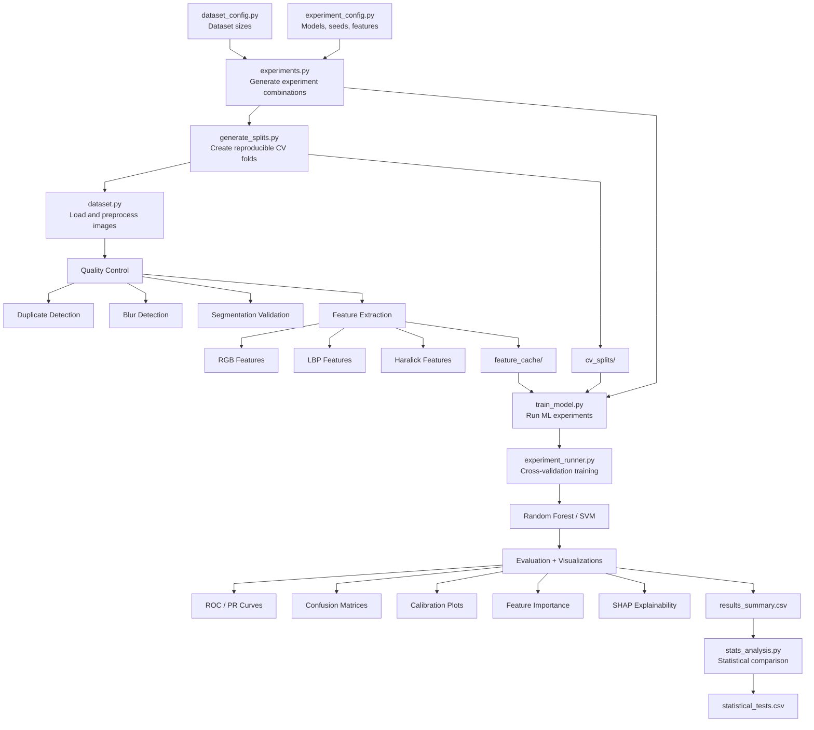
```mermaid
%%{init: {
  "flowchart": {
    "curve": "linear",
    "nodeSpacing": 35,
    "rankSpacing": 45
  }
}}%%

flowchart TD

A[dataset_config.py<br>Dataset sizes]
--> C[experiments.py<br>Generate experiment combinations]

B[experiment_config.py<br>Models, seeds, features]
--> C

C --> D[generate_splits.py<br>Create reproducible CV folds]

D --> E[dataset.py<br>Load and preprocess images]

E --> F[Quality Control]

F --> F1[Duplicate Detection]
F --> F2[Blur Detection]
F --> F3[Segmentation Validation]

F --> G[Feature Extraction]

G --> G1[RGB Features]
G --> G2[LBP Features]
G --> G3[Haralick Features]

G --> H[feature_cache/]

D --> I[cv_splits/]

H --> J[train_model.py<br>Run ML experiments]
I --> J
C --> J

J --> K[experiment_runner.py<br>Cross-validation training]

K --> L[Random Forest / SVM]

L --> M[Evaluation + Visualizations]

M --> M1[ROC / PR Curves]
M --> M2[Confusion Matrices]
M --> M3[Calibration Plots]
M --> M4[Feature Importance]
M --> M5[SHAP Explainability]

M --> N[results_summary.csv]

N --> O[stats_analysis.py<br>Statistical comparison]

O --> P[statistical_tests.csv]
```

## Preprocessing Pipeline

Implemented preprocessing operations:
- image resizing (`512×512`)
- grayscale conversion
- Gaussian smoothing
- Otsu thresholding
- morphological cleanup
- tissue/background segmentation
- segmentation quality safeguards
- duplicate image detection
- blur detection
- brightness/contrast quality checks

Stain normalization experiments:
- no normalization
- Reinhard normalization

## Feature Extraction

Implemented handcrafted descriptors:

| RGB Color Features  | Local Binary Pattern (LBP) |
| ------------- |:-------------|
| channel means      | texture histograms     |
| channel standard deviations      | local texture representation     |

### Haralick Texture Features
- GLCM texture descriptors
- contrast
- homogeneity
- entropy
- correlation
- energy

Feature combinations tested:
- color
- LBP
- Haralick
- color + LBP
- color + Haralick
- LBP + Haralick
- all features combined

## Models
| Random Forest  | Support Vector Machine (RBF) |
| ------------- |:-------------|
| tree-based ensemble classifier      | scaled and unscaled variants     |
| permutation importance analysis      | GridSearchCV tuning     |
| SHAP explainability      | kernel-based nonlinear classification     |

## Training Strategy

Implemented training strategy:
- repeated stratified cross-validation
- deterministic fold generation
- fixed random seeds
- GridSearchCV hyperparameter tuning
- cached feature extraction
- automated experiment generation
- automated experiment skipping
- fold-level prediction saving

## Reproducibility

Reproducibility safeguards implemented:
- fixed random seeds
- deterministic CV splits
- centralized experiment generation
- cached feature extraction
- saved experiment configurations
- fold-level prediction storage
- automated summary CSV rebuilding
- statistical testing utilities
- experiment metadata logging

## Cross-Validation Strategy
The dataset is evaluated using repeated stratified cross-validation with fixed random seeds for reproducibility.

Current limitation:
- the public dataset does not provide patient-level identifiers
- therefore image-level splitting is used
- this may introduce hidden patient-level leakage

This limitation is explicitly acknowledged during interpretation of results.

## Evaluation Metrics
| Primary metrics |  | Additional analysis |  | Statistical Analysis | 
| --------------- | ------------------- | ------------------- | ------------------- | ------------------- |
| Accuracy |  | ROC curves |  | corrected paired t-test |
| AUC |  | Precision-Recall curves |  | Wilcoxon signed-rank test |
| PR-AUC |  | confusion matrices |  | Welch’s t-test |
| Precision |  | calibration curves |  | Mann–Whitney U test |
| Sensitivity |  | learning curves |  | Cohen’s d effect size analysis |
| Specificity |  | feature importance analysis |
| F1-score |  | SHAP explainability |
| MCC | 
| Brier score |

## Repository Structure
```text
oral-cancer-histopathology-ml/
│
├── src/
│   ├── dataset.py
│   ├── feature_extraction.py
│   ├── experiment_runner.py
│   ├── explainability.py
│   ├── evaluation.py
│   ├── learning_curve_analysis.py
│   ├── model_utils.py
│   ├── plotting.py
│   ├── results_utils.py
│   ├── statistics_utils.py
│   └── visualize_results.py
│
├── results/
│   └── seed_42/
│       ├── experiment_1/
│       ├── experiment_2/
│       └── ...
│
├── feature_cache/
├── cv_splits/
├── data/
├── train_model.py
├── rebuild_summary.py
├── stats_analysis.py
└── requirements.txt
```

## Installation
- Clone Repository: 
    - ```git clone https://github.com/yourusername/oral-cancer-histopathology-ml.git```
    - ```cd oral-cancer-histopathology-ml```
- Create virtual env: ```python -m venv venv```
- Activate venv:
    - Windows: ```venv\Scripts\activate```
    - Linux/Mac: ```source venv/bin/activate```
- Install dependencies: ```pip install -r requirements.txt```
- Test all files before training model: ```pytest```
- Generate cross-validation splits: ```python generate_splits.py```
- Run experiment: ```python train_model.py```
- Rebuild summary CSV: ```python rebuild_summary.py```
- Run statistical analysis: ```python stats_analysis.py```

## Sample Histopathology Images
| Normal 100x                             | OSCC 100x                             | Normal 400x                             | OSCC 400x                             |
| --------------------------------------- | ------------------------------------- | --------------------------------------- | ------------------------------------- |
| 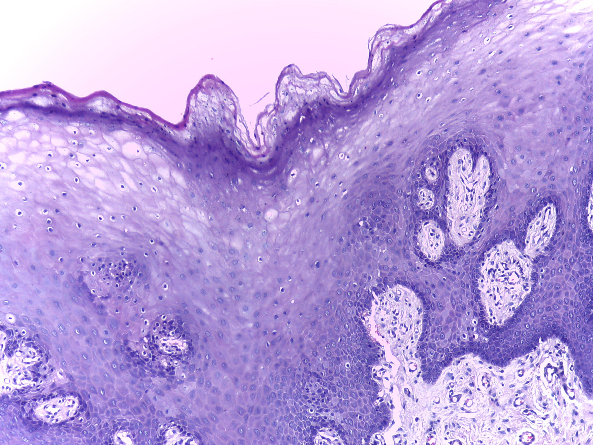 | 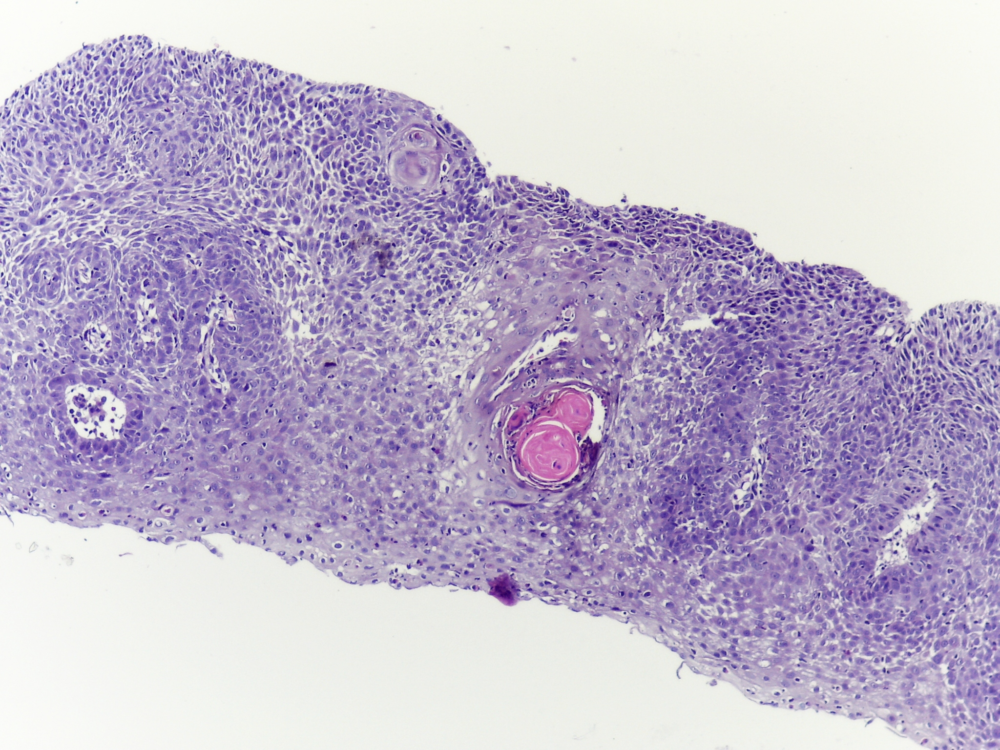 | 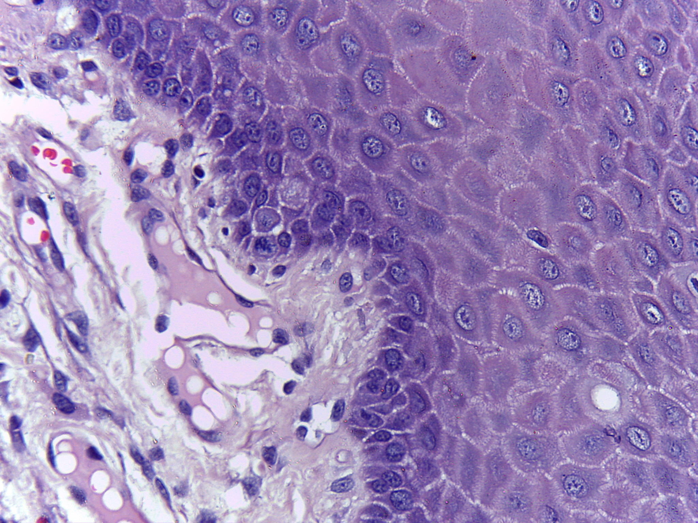 | 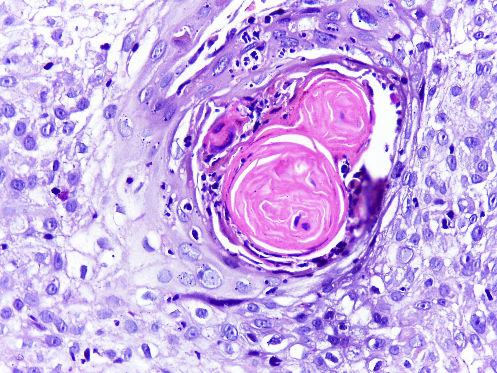 |

## Example Outputs

### Best SVM Configuration: ```svm_scaled_all_no_norm_full_100x_seed_42```

| ROC Curve                             | Precision-Recall Curve                             | Confusion Matrix                             | Calibration Plot                             |
| --------------------------------------- | ------------------------------------- | --------------------------------------- | ------------------------------------- |
| 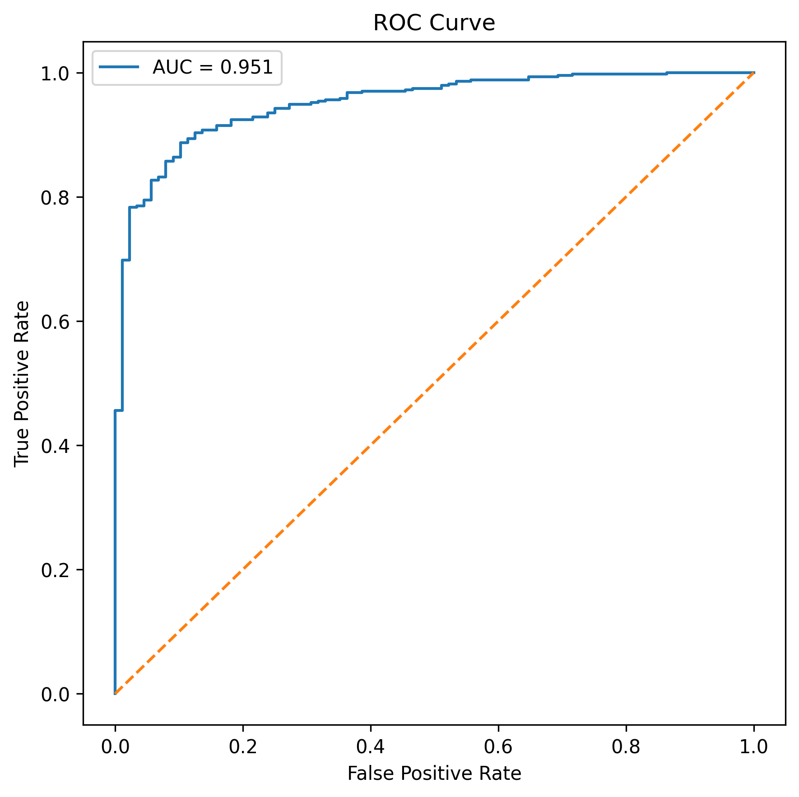 | 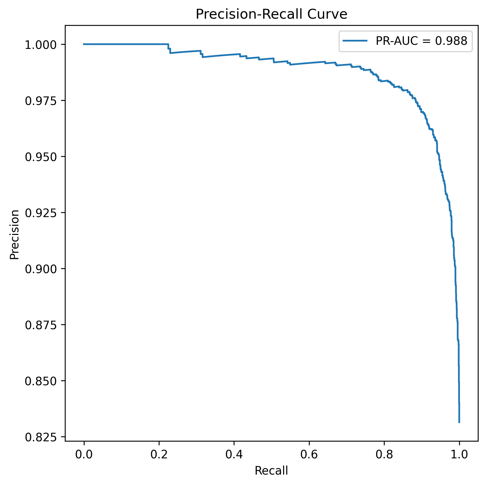 | 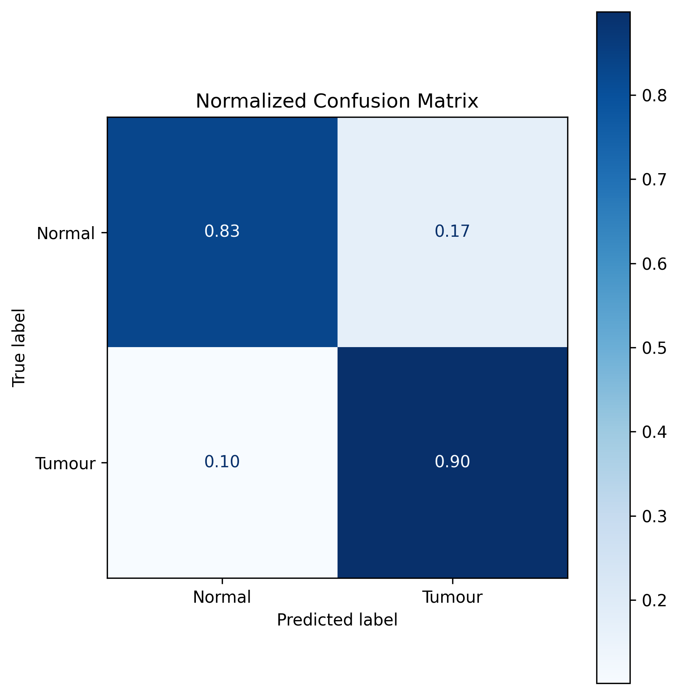 | 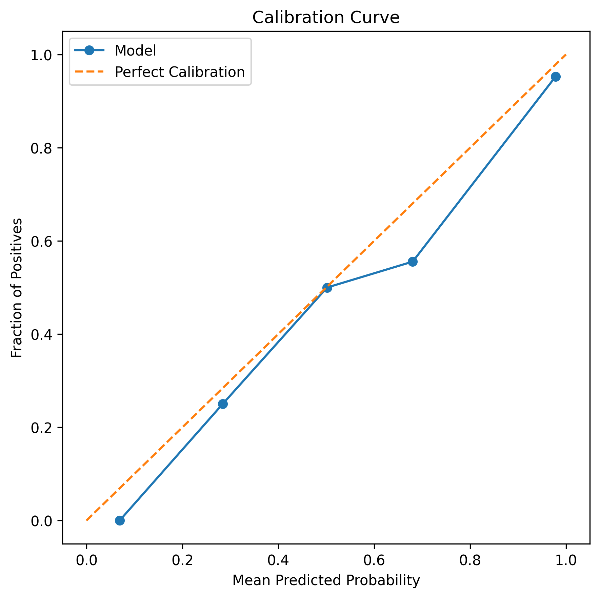 |

---

### Best Random Forest Configuration: ```rf_unscaled_haralick_reinhard_full_100x_seed_42```
| Feature Correlation                             | Feature Importance                             | SHAP Explainability (Random Forest)                             |
| --------------------------------------- | ------------------------------------- | ------------------------------------- |
| 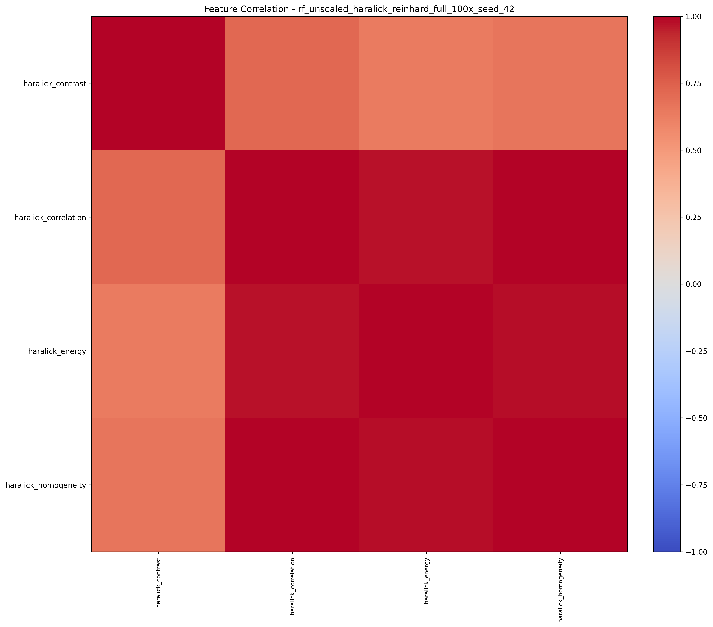   |  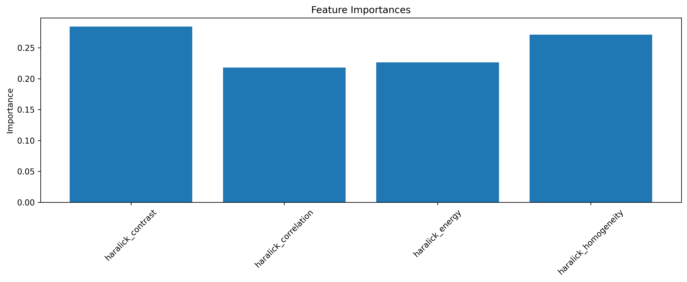    | 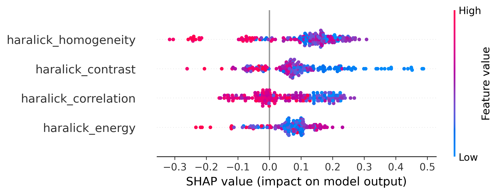

---

| AUC Learning Curve | F1 Learning Curve |
|---|---|
| 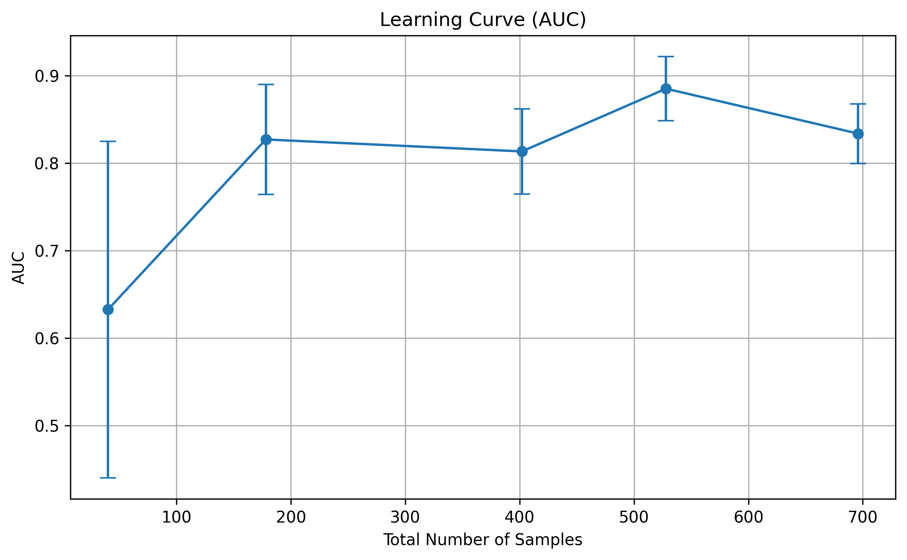 | 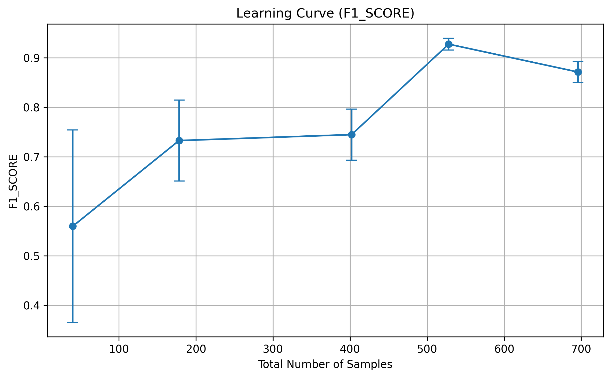 |

## Preliminary Findings
Initial experiments suggest:
- SVM models generally outperform Random Forest models
- 100x magnification frequently outperforms 400x
- feature scaling improves SVM stability
- handcrafted texture descriptors improve discrimination in several settings
- larger datasets improve metric stability
- class imbalance strongly affects specificity
- small datasets produce unstable fold variance
- calibration analysis is important for medical ML evaluation

## Statistical Findings
Statistical testing revealed:
- significant performance differences between 100x and 400x magnifications
- significant improvements from feature scaling in SVM models
- strong contribution of Haralick texture descriptors
- substantial instability in smaller datasets
- limited measurable effect from Reinhard stain normalization under current settings
- Detailed statistical outputs are available in: `statistical_tests.csv`

## Best Performing Configurations
| Experiment | Model | Features | Magnification | Stain Norm | Mean AUC | Mean F1 |
|---|---|---|---|---|---|---|
| svm_scaled_all_no_norm_full_100x_seed_42 | SVM | All | 100x | None | 0.986 | 0.94 |
| svm_scaled_haralick_reinhard_full_100x_seed_42 | SVM | Haralick | 100x | Reinhard | 0.981 | 0.93 |
| rf_unscaled_haralick_reinhard_full_100x_seed_42 | RF | Haralick | 100x | Reinhard | 0.849 | 0.92 |

## Outputs Generated Per Experiment
Each experiment automatically saves:
- fold metrics CSV
- prediction CSVs
- best hyperparameters
- ROC curves
- PR curves
- confusion matrices
- calibration plots
- feature importance plots
- SHAP explainability plots
- experiment configuration files
- summary metrics

## Lessons Learned During Development
Key observations during development:
- small histopathology datasets produce unstable variance
- AUC alone can hide specificity collapse
- calibration analysis matters in medical ML
- feature scaling significantly impacts SVM performance
- stain normalization effects are configuration-dependent
- reproducibility infrastructure becomes critical at scale
- automated experiment management prevents manual tracking errors
- cached feature extraction dramatically improves iteration speed
- summary CSV rebuilding is important for interrupted experiments

## Current Development Status

### Implemented
- preprocessing pipeline
- handcrafted feature extraction
- experiment automation
- cross-validation benchmarking
- statistical testing
- calibration analysis
- learning curve analysis
- feature caching system
- duplicate detection
- explainability analysis

### In Progress
- seed stability analysis
- stain normalization benchmarking
- experiment optimization
- robustness evaluation

### Planned
- deep learning benchmarking
- HistoSet integration
- pancreatic histopathology experiments
- domain generalization analysis
- external dataset evaluation

## Limitations
- no patient-wise splitting available
- dataset imbalance
- single-source dataset
- no external validation dataset
- handcrafted descriptors cannot capture all morphology patterns
- possible hidden patient-level leakage due to image-level splitting
- stain normalization benchmarking still ongoing

## Future Directions
Planned future work:
- CNN benchmarking
- transfer learning experiments
- attention-based architectures
- domain adaptation
- multi-magnification fusion
- external validation datasets
- pathology foundation models
- handcrafted vs deep feature comparison

## Citation
If you use this repository, please cite the original dataset creators.

```bibtex
@dataset{oral_cancer_dataset,
  title={Histopathological imaging database for Oral Cancer analysis},
  doi={10.17632/ftmp4cvtmb.2}
}
```

---

Date Updated: <!--LAST_UPDATED--> 26-05-2026

---

```


---

# configs

## __init__.py

```python

```

## dataset_config.py

```python
DATASET_CONFIGS = {
    "100x": [
        ("20img", 20, 20),
        ("89img", 89, 89),
        ("full", 89, 439),
    ],

    "400x": [
        ("20img", 20, 20),
        ("201img", 201, 201),
        ("full", 201, 495),
    ],
}

```

## experiment_config.py

```python
from configs.preprocessing_config import STAIN_NORMALIZATION_METHODS

N_SPLITS = 5
N_REPEATS = 5
TOTAL_CV_ITERATIONS = N_SPLITS * N_REPEATS
SEEDS = [42] # 42 103 368
MODELS = ["rf", "svm"]
MAGNIFICATIONS = ["100x", "400x"]
STAIN_NORMALIZATION_OPTIONS = (STAIN_NORMALIZATION_METHODS)

FEATURE_SETS = [
    "color",
    "lbp",
    "haralick",
    "color_lbp",
    "color_haralick",
    "lbp_haralick",
    "all"
]

```

## model_config.py

```python
RF_PARAM_GRID = {
    "classifier__n_estimators": [100, 200],
    "classifier__max_depth": [None, 10, 20],
    "classifier__min_samples_split": [2, 5],
    "classifier__min_samples_leaf": [1, 2]
}

SVM_PARAM_GRID = {
    "classifier__C": [0.1, 1, 10],
    "classifier__gamma": ["scale", 0.01, 0.001]
}

```

## preprocessing_config.py

```python
IMAGE_SIZE = (512, 512)
MIN_TISSUE_FRACTION = 0.05
MAX_TISSUE_FRACTION = 0.95
GAUSSIAN_KERNEL_SIZE = (5, 5)
MORPH_KERNEL_SIZE = (7, 7)
MIN_COMPONENT_AREA_RATIO = 0.001
DARK_IMAGE_THRESHOLD = 15
STAIN_NORMALIZATION_METHODS = [None, "reinhard", "macenko"]
STAIN_NORMALIZATION_TARGET_IMAGE = ("data/target_stain_image.jpg")

```


---

# .

## dataset.py

```python
import os
import numpy as np
import pandas as pd
from src.features import extract_features
from src.data_quality import run_quality_checks

from src.preprocessing import (
    load_image, 
    segment_tissue,
    normalize_staining,
    load_target_image,
    create_reinhard_normalizer
)


IMAGE_EXTENSIONS = {".png", ".jpg", ".jpeg", ".tif", ".tiff", ".bmp"}

def _list_image_files(folder):
    if not os.path.isdir(folder):
        raise FileNotFoundError(f"Folder not found: {folder}")

    files = []
    for name in sorted(os.listdir(folder)):
        ext = os.path.splitext(name)[1].lower()
        if ext in IMAGE_EXTENSIONS:
            files.append(name)
    return files

def _limit_files(files, limit, seed=42):
    if limit is None or limit >= len(files):
        return files

    rng = np.random.default_rng(seed)

    selected_indices = rng.choice(
        len(files),
        size = limit,
        replace = False
        )

    selected_indices = sorted(selected_indices)

    return [files[i] for i in selected_indices]

def build_dataset(
    magnification = "100x",
    num_normal = None,
    num_tumour = None,
    feature_set = "all",
    stain_normalization = None,
    seed=42
    ):
    
    normal_dir = f"data/{magnification}/normal"
    tumour_dir = f"data/{magnification}/tumour"

    normal_files = _limit_files(_list_image_files(normal_dir), num_normal, seed=seed)
    tumour_files = _limit_files(_list_image_files(tumour_dir), num_tumour, seed=seed)

    print(f"Using {len(normal_files)} normal images")
    print(f"Using {len(tumour_files)} tumour images")

    X = []
    y = []

    image_paths = []
    seen_hashes = set()

    normalizer = None

    if stain_normalization == "reinhard":
        target_image = load_target_image()
        normalizer = create_reinhard_normalizer(target_image)

    # NORMAL LOOP
    for filename in normal_files:
        path = os.path.join(normal_dir, filename)
        try:
            img = load_image(path)

            run_quality_checks(
                img,
                seen_hashes = seen_hashes
            )

            if stain_normalization is not None:
                img = normalize_staining(
                    img,
                    method = stain_normalization,
                    normalizer = normalizer
                )

            mask = segment_tissue(img)

            features = extract_features(
                img,
                mask,
                feature_set = feature_set
            )

            X.append(features)
            y.append(0)
            image_paths.append(path)
        except Exception as e:
            print(f"Failed NORMAL: {filename}")
            print(e)

    # TUMOUR LOOP
    for filename in tumour_files:
        path = os.path.join(tumour_dir, filename)
        try:
            img = load_image(path)

            run_quality_checks(
                img,
                seen_hashes = seen_hashes
            )

            if stain_normalization is not None:
                img = normalize_staining(
                    img,
                    method = stain_normalization,
                    normalizer = target_image
                )

            mask = segment_tissue(img)

            features = extract_features(
                img,
                mask,
                feature_set = feature_set
            )

            X.append(features)
            y.append(1)
            image_paths.append(path)
        except Exception as e:
            print(f"Failed TUMOUR: {filename}")
            print(e)

    X = np.asarray(X, dtype = float)
    y = np.asarray(y, dtype = int)

    if len(X) == 0:
        raise ValueError("No images were loaded.")

    used_files = {
        "magnification": magnification,
        "normal_files": normal_files,
        "tumour_files": tumour_files
    }

    assert len(X) == len(image_paths)
    assert len(y) == len(image_paths)

    dataset_index = pd.DataFrame({
        "index": np.arange(len(image_paths)),
        "image_path": image_paths,
        "label": y
    })

    dataset_index.to_csv(
        f"data/{magnification}/dataset_index.csv",
        index=False
    )

    return X, y, used_files, image_paths

```

## demo.py

```python
import cv2
import numpy as np
import matplotlib.pyplot as plt
from skimage.feature import local_binary_pattern
from skimage.feature import graycomatrix, graycoprops

# CONFIG
IMAGE_SIZE = (512, 512)
LBP_RADIUS = 1
LBP_POINTS = 8 * LBP_RADIUS
MIN_TISSUE_FRACTION = 0.05

# IMAGE LOAD
def load_image(path):
    img = cv2.imread(path)

    if img is None:
        raise ValueError(f"Could not load image: {path}")

    img = cv2.cvtColor(img, cv2.COLOR_BGR2RGB)
    return img

# PREPROCESSING
def preprocess_image(img):
    resized = cv2.resize(img, IMAGE_SIZE)
    gray = cv2.cvtColor(resized, cv2.COLOR_RGB2GRAY)

    _, mask = cv2.threshold(
        gray,
        0,
        255,
        cv2.THRESH_BINARY_INV + cv2.THRESH_OTSU
    )

    kernel = np.ones((3, 3), np.uint8)

    mask = cv2.morphologyEx(
        mask,
        cv2.MORPH_OPEN,
        kernel
    )

    mask = cv2.morphologyEx(
        mask,
        cv2.MORPH_CLOSE,
        kernel
    )

    tissue = resized.copy()
    tissue[mask == 0] = 255

    return resized, gray, mask, tissue

# EDGE MAP
def compute_edges(gray):

    edges = cv2.Canny(
        gray,
        threshold1 = 80,
        threshold2 = 160
    )

    return edges

# LBP FEATURES
def compute_lbp(gray):

    lbp = local_binary_pattern(
        gray,
        P = LBP_POINTS,
        R = LBP_RADIUS,
        method = "uniform"
    )

    return lbp

# HARALICK FEATURES
def compute_haralick(gray, mask):
    tissue_fraction = np.mean(mask > 0)

    if tissue_fraction < MIN_TISSUE_FRACTION:
        return {
            "contrast": 0.0,
            "correlation": 0.0,
            "energy": 0.0,
            "homogeneity": 0.0
        }

    ys, xs = np.where(mask > 0)

    if len(xs) == 0 or len(ys) == 0:
        return {
            "contrast": 0.0,
            "correlation": 0.0,
            "energy": 0.0,
            "homogeneity": 0.0
        }
 
    x_min, x_max = xs.min(), xs.max()
    y_min, y_max = ys.min(), ys.max()

    cropped_gray = gray[
        y_min:y_max + 1,
        x_min:x_max + 1
    ]

    cropped_mask = mask[
        y_min:y_max + 1,
        x_min:x_max + 1
    ]

    rows_t, cols_t = np.where(cropped_mask > 0)

    if len(rows_t) == 0:
        return {
            "contrast": 0.0,
            "correlation": 0.0,
            "energy": 0.0,
            "homogeneity": 0.0
        }
 
    y0, y1 = rows_t.min(), rows_t.max()
    x0, x1 = cols_t.min(), cols_t.max()

    tight_gray = cropped_gray[
        y0:y1 + 1,
        x0:x1 + 1
    ]

    tight_mask = cropped_mask[
        y0:y1 + 1,
        x0:x1 + 1
    ]

    tissue_density = np.mean(tight_mask > 0)

    if tissue_density < 0.70:

        return {
            "contrast": 0.0,
            "correlation": 0.0,
            "energy": 0.0,
            "homogeneity": 0.0
        }

    tissue_gray = tight_gray.copy()
    tissue_gray[tight_mask == 0] = 0

    # Quantize to 16 gray levels
    tissue_gray = (tissue_gray // 16).astype(np.uint8)

    glcm = graycomatrix(
        tissue_gray,
        distances = [1],
        angles = [0, np.pi/4, np.pi/2, 3*np.pi/4],
        levels = 16,
        symmetric = True,
        normed = True
    )

    features = {}

    for prop in [
        "contrast",
        "correlation",
        "energy",
        "homogeneity"
    ]:

        features[prop] = float(
            graycoprops(glcm, prop).mean()
        )

    return features

# COLOUR FEATURES
def compute_color_features(img, mask):

    pixels = img[mask > 0]

    if len(pixels) == 0:
        return {}

    features = {

        "mean_r": np.mean(pixels[:, 0]),
        "mean_g": np.mean(pixels[:, 1]),
        "mean_b": np.mean(pixels[:, 2]),

        "std_r": np.std(pixels[:, 0]),
        "std_g": np.std(pixels[:, 1]),
        "std_b": np.std(pixels[:, 2])
    }

    return features

# MAIN PIPELINE
def show_pipeline(image_path, title="IMAGE"):

    print("\n" + "=" * 60)
    print(f"PROCESSING: {title}")
    print("=" * 60)

    img = load_image(image_path)
    resized, gray, mask, tissue = preprocess_image(img)
    edges = compute_edges(gray)
    haralick = compute_haralick(gray, mask)
    color_features = compute_color_features(resized, mask)

    print("\nColor Features:")

    for k, v in color_features.items():
        print(f"{k}: {v:.4f}")

    print("\nHaralick Features:")

    for k, v in haralick.items():
        print(f"{k}: {v:.4f}")

    feature_text = (
        f"Haralick Features\n\n"
        f"Contrast      : {haralick['contrast']:.4f}\n"
        f"Correlation   : {haralick['correlation']:.4f}\n"
        f"Energy        : {haralick['energy']:.4f}\n"
        f"Homogeneity   : {haralick['homogeneity']:.4f}\n\n"
        f"Color Features\n\n"
        f"Mean R        : {color_features['mean_r']:.2f}\n"
        f"Mean G        : {color_features['mean_g']:.2f}\n"
        f"Mean B        : {color_features['mean_b']:.2f}"
    )

    fig, axes = plt.subplots(
        2,
        3,
        figsize = (16, 10)
    )

    fig.suptitle(
        title,
        fontsize = 22,
        fontweight = 'bold'
    )

    # Original image
    axes[0, 0].imshow(resized)
    axes[0, 0].set_title("Original Image")
    axes[0, 0].axis("off")

    # Grayscale
    axes[0, 1].imshow(gray, cmap = "gray")
    axes[0, 1].set_title("Grayscale")
    axes[0, 1].axis("off")

    # Tissue mask
    axes[0, 2].imshow(mask, cmap = "gray")
    axes[0, 2].set_title("Tissue Mask")
    axes[0, 2].axis("off")

    # Masked tissue
    axes[1, 0].imshow(tissue)
    axes[1, 0].set_title("Masked Tissue")
    axes[1, 0].axis("off")

    # Edge map
    axes[1, 1].imshow(edges, cmap = "gray")
    axes[1, 1].set_title("Canny Edge Map")
    axes[1, 1].axis("off")

    # Feature summary
    axes[1, 2].text(
        0.02,
        0.98,
        feature_text,
        fontsize = 11,
        verticalalignment = 'top',
        family = 'monospace'
    )

    axes[1, 2].set_title("Extracted Features")
    axes[1, 2].axis("off")

    plt.tight_layout()
    plt.show()

# MAIN
if __name__ == "__main__":

    # 100x normal
    show_pipeline(
        "data/100x/normal/Normal_100x_45.jpg",
        "100x NORMAL"
    )

    # 100 tumour
    show_pipeline(
        "data/100x/tumour/OSCC_100x_363.jpg",
        "100x TUMOUR"
    )

    # 400x normal
    show_pipeline(
        "data/400x/normal/Normal_400x_153.jpg",
        "400x NORMAL"
    )

    # 400x tumour
    show_pipeline(
        "data/400x/tumour/OSCC_400x_15.jpg",
        "400x TUMOUR"
    )

```

## experiments.py

```python
from itertools import product
from configs.dataset_config import DATASET_CONFIGS

from configs.experiment_config import (
    MODELS,
    MAGNIFICATIONS,
    FEATURE_SETS,
    STAIN_NORMALIZATION_OPTIONS,
    SEEDS,
)

def generate_experiment_name(
    model,
    feature_set,
    dataset_name,
    magnification,
    use_scaling,
    stain_normalization,
    seed
    ):
    
    parts = [
        model,
        "scaled" if use_scaling else "unscaled"
    ]

    parts.extend([
        feature_set,
        stain_normalization
            if stain_normalization is not None
            else "no_norm"
    ])

    parts.extend([
        dataset_name,
        magnification,
        f"seed_{seed}"
    ])

    return "_".join(parts)

def generate_experiments():
    experiments = []

    for model, magnification, feature_set, stain_normalization, seed in product(
        MODELS,
        MAGNIFICATIONS,
        FEATURE_SETS,
        STAIN_NORMALIZATION_OPTIONS,
        SEEDS
    ):

        if model == "rf":
            scaling_configs = [False]

        elif model == "svm":
            scaling_configs = [True, False]

        datasets = DATASET_CONFIGS[magnification]

        for use_scaling in scaling_configs:
            for dataset_name, num_normal, num_tumour in datasets:

                experiment = {
                    "name": generate_experiment_name(
                        model,
                        feature_set,
                        dataset_name,
                        magnification,
                        use_scaling,
                        stain_normalization,
                        seed
                    ),

                    "model": model,
                    "feature_set": feature_set,
                    "magnification": magnification,
                    "num_normal": num_normal,
                    "num_tumour": num_tumour,
                    "use_scaling": use_scaling,
                    "stain_normalization": stain_normalization,
                    "seed": seed
                }

                experiments.append(experiment)
    return experiments

def validate_experiments(experiments):
    required_keys = {
        "name",
        "model",
        "feature_set",
        "magnification",
        "num_normal",
        "num_tumour",
        "use_scaling",
        "stain_normalization",
        "seed"
    }

    names = set()

    for exp in experiments:

        missing = required_keys - exp.keys()
        assert not missing, \
            f"Missing keys: {missing}"

        assert exp["name"] not in names, \
            f"Duplicate experiment name: {exp['name']}"
        names.add(exp["name"])

        assert exp["num_normal"] > 0
        assert exp["num_tumour"] > 0

    print("All experiments validated!")

EXPERIMENTS = generate_experiments()
validate_experiments(EXPERIMENTS)

```

## generate_splits.py

```python
import os
import numpy as np
from dataset import build_dataset
from experiments import EXPERIMENTS
from sklearn.model_selection import RepeatedStratifiedKFold


def generate_splits():
    generated = set()

    for config in EXPERIMENTS:
        magnification = config["magnification"]
        num_normal = config["num_normal"]
        num_tumour = config["num_tumour"]
        seed = config["seed"]

        split_key = (
            magnification,
            num_normal,
            num_tumour,
            seed
        )

        if split_key in generated:
            continue

        generated.add(split_key)

        print("\nGenerating splits for:")
        print(split_key)

        X, y, used_files, image_paths = build_dataset(
            magnification = magnification,
            num_normal = num_normal,
            num_tumour = num_tumour,
            feature_set = "all"
        )

        split_dir = (
            f"cv_splits/"
            f"{magnification}_"
            f"{num_normal}_"
            f"{num_tumour}_"
            f"seed_{seed}"
        )

        os.makedirs(split_dir, exist_ok = True)

        rskf = RepeatedStratifiedKFold(
            n_splits = 5,
            n_repeats = 5,
            random_state = seed
        )

        for fold, (train_idx, test_idx) in enumerate(
            rskf.split(X, y),
            start = 1
        ):

            np.save(
                os.path.join(
                    split_dir,
                    f"train_idx_fold_{fold}.npy"
                ),
                train_idx
            )

            np.save(
                os.path.join(
                    split_dir,
                    f"test_idx_fold_{fold}.npy"
                ),
                test_idx
            )

    print("\nAll splits generated.")


if __name__ == "__main__":
    generate_splits()

```

## rebuild_summary.py

```python
import os
import pandas as pd

from src.results_utils import (
    initialize_summary_csv,
    append_summary_row
)

SUMMARY_CSV = "results_summary.csv"

if os.path.exists(SUMMARY_CSV):
    os.remove(SUMMARY_CSV)

initialize_summary_csv(SUMMARY_CSV)

results_root = "results"

for seed_folder in os.listdir(results_root):

    seed_path = os.path.join(
        results_root,
        seed_folder
    )

    if not os.path.isdir(seed_path):
        continue

    for experiment_name in os.listdir(seed_path):

        experiment_dir = os.path.join(
            seed_path,
            experiment_name
        )

        if not os.path.isdir(experiment_dir):
            continue

        config_path = os.path.join(
            experiment_dir,
            "config.json"
        )

        fold_metrics_path = os.path.join(
            experiment_dir,
            "fold_metrics.csv"
        )

        if (
            not os.path.exists(config_path)
            or
            not os.path.exists(fold_metrics_path)
        ):
            continue

        config = pd.read_json(
            config_path,
            typ = "series"
        ).to_dict()

        fold_df = pd.read_csv(
            fold_metrics_path
        )

        append_summary_row(
            SUMMARY_CSV,
            config,
            fold_df
        )

        print(f"Added: {experiment_name}")

print("\nSummary CSV rebuilt successfully.")

```


---

# src

## __init__.py

```python

```

## analysis_plots.py

```python
import os
import numpy as np

import matplotlib
matplotlib.use("Agg")
import matplotlib.pyplot as plt


def plot_class_distribution(y, save_path, title = "Class Distribution"):
    save_dir = os.path.dirname(save_path)
    if save_dir:
        os.makedirs(save_dir, exist_ok = True)

    counts = np.bincount(y.astype(int), minlength = 2)

    plt.figure(figsize = (5, 4))
    plt.bar(["Normal", "Tumour"], counts)
    plt.ylabel("Count")
    plt.title(title)
    plt.tight_layout()
    plt.savefig(save_path, dpi = 300, bbox_inches = "tight")
    plt.close()


def plot_feature_correlation(X, feature_names, save_path, title = "Feature Correlation Heatmap"):
    save_dir = os.path.dirname(save_path)
    if save_dir:
        os.makedirs(save_dir, exist_ok = True)

    corr = np.corrcoef(X, rowvar = False)

    plt.figure(figsize = (14, 12))
    im = plt.imshow(corr, cmap = "coolwarm", vmin = -1, vmax = 1)
    plt.colorbar(im, fraction = 0.046, pad = 0.04)
    plt.xticks(range(len(feature_names)), feature_names, rotation = 90, fontsize = 8)
    plt.yticks(range(len(feature_names)), feature_names)
    plt.title(title)
    plt.tight_layout()
    plt.savefig(save_path, dpi = 300, bbox_inches = "tight")
    plt.close()

```

## cache_utils.py

```python
import pickle
from pathlib import Path
from dataset import build_dataset

CACHE_VERSION = "v2"

def get_or_cache_dataset(
    magnification,
    num_normal,
    num_tumour,
    feature_set,
    cache_dir="feature_cache",
    stain_normalization = None,
    seed = None
    ):

    key = (
        f"{CACHE_VERSION}_"
        f"{magnification}_"
        f"{num_normal}_"
        f"{num_tumour}_"
        f"feature_set_{feature_set}_"
        f"stain_{stain_normalization or 'no_norm'}_"
        f"seed_{seed}"
        )

    cache_path = Path(cache_dir) / f"{key}.pkl"

    if cache_path.exists():
        print(f"Loading cached dataset: {cache_path}")

        with open(cache_path, "rb") as f:
            return pickle.load(f)

    print(f"Building dataset and caching: {key}")

    X, y, used_files, image_paths = build_dataset(
        magnification = magnification,
        num_normal = num_normal,
        num_tumour = num_tumour,
        feature_set = feature_set,
        stain_normalization = stain_normalization,
        seed = seed
    )

    cache_path.parent.mkdir(exist_ok = True)

    with open(cache_path, "wb") as f:
        pickle.dump(
            (X, y, used_files, image_paths),
            f,
            protocol=pickle.HIGHEST_PROTOCOL
        )

    return X, y, used_files, image_paths

```

## data_quality.py

```python
import cv2
import imagehash
from PIL import Image

BLUR_THRESHOLD = 100.0
MIN_BRIGHTNESS = 20
MAX_BRIGHTNESS = 235
MIN_CONTRAST = 15


def check_blur(img):
    gray = cv2.cvtColor(img, cv2.COLOR_RGB2GRAY)
    variance = cv2.Laplacian(gray,cv2.CV_64F).var()

    if variance < BLUR_THRESHOLD:
        raise ValueError(
            f"Blurry image detected "
            f"(variance = {variance:.2f})"
        )


def check_brightness(img):
    gray = cv2.cvtColor(img, cv2.COLOR_RGB2GRAY)
    brightness = gray.mean()

    if brightness < MIN_BRIGHTNESS:
        raise ValueError(
            f"Image too dark "
            f"(brightness = {brightness:.2f})"
        )

    if brightness > MAX_BRIGHTNESS:
        raise ValueError(
            f"Image too bright "
            f"(brightness = {brightness:.2f})"
        )


def check_contrast(img):
    gray = cv2.cvtColor(img, cv2.COLOR_RGB2GRAY)
    contrast = gray.std()

    if contrast < MIN_CONTRAST:
        raise ValueError(
            f"Low contrast image "
            f"(std = {contrast:.2f})"
        )


def compute_image_hash(img):
    pil_img = Image.fromarray(img)
    return str(imagehash.phash(pil_img))


def check_duplicate(img_hash, seen_hashes):
    if img_hash in seen_hashes:
        raise ValueError("Duplicate image detected.")

    seen_hashes.add(img_hash)


def run_quality_checks(
    img,
    seen_hashes = None
):

    check_blur(img)
    check_brightness(img)
    check_contrast(img)

    if seen_hashes is not None:
        img_hash = compute_image_hash(img)
        check_duplicate(img_hash, seen_hashes)

```

## evaluation_utils.py

```python
import os

from src.visualize_results import (
    plot_roc_curve,
    plot_pr_curve,
    plot_confusion_matrix
)


def save_overall_evaluation(
    all_y_test,
    all_y_pred,
    all_y_prob,
    results_dir
):

    plot_roc_curve(
        all_y_test,
        all_y_prob,
        os.path.join(
            results_dir,
            "roc_curve.png"
        ),
        csv_path = os.path.join(
            results_dir,
            "roc_curve_data.csv"
        )
    )

    plot_pr_curve(
        all_y_test,
        all_y_prob,
        os.path.join(
            results_dir,
            "pr_curve.png"
        ),
        csv_path = os.path.join(
            results_dir,
            "pr_curve_data.csv"
        )
    )

    plot_confusion_matrix(
        all_y_test,
        all_y_pred,
        os.path.join(
            results_dir,
            "confusion_matrix_overall.png"
        ),
        normalize = True,
        csv_path = os.path.join(
            results_dir,
            "confusion_matrix_overall.csv"
        )
    )

```

## experiment_runner.py

```python
import os
import numpy as np
from src.metrics_utils import compute_all_metrics
from src.explainability import plot_permutation_importance

from src.model_utils import (
    get_model,
    get_param_grid
)

from src.visualize_results import (
    plot_confusion_matrix,
    plot_calibration_curve
)

from sklearn.model_selection import (
    GridSearchCV,
    StratifiedKFold
)


def run_fold(
    fold,
    X,
    y,
    image_paths,
    split_dir,
    model_type,
    results_dir,
    experiment_name,
    feature_names,
    use_scaling,
    seed
):

    train_idx = np.load(
        os.path.join(
            split_dir,
            f"train_idx_fold_{fold}.npy"
        )
    )

    test_idx = np.load(
        os.path.join(
            split_dir,
            f"test_idx_fold_{fold}.npy"
        )
    )

    X_train = X[train_idx]
    X_test = X[test_idx]

    y_train = y[train_idx]
    y_test = y[test_idx]

    base_model = get_model(
        model_type,
        use_scaling=use_scaling,
        seed=seed
    )

    param_grid = get_param_grid(model_type)

    grid = GridSearchCV(
        estimator=base_model,
        param_grid=param_grid,
        scoring="roc_auc",
        cv=StratifiedKFold(
            n_splits=3,
            shuffle=True,
            random_state=seed
        ),
        n_jobs=-1,
        refit=True,
        return_train_score=True
    )

    grid.fit(X_train, y_train)

    clf = grid.best_estimator_

    y_pred = clf.predict(X_test)
    y_prob = clf.predict_proba(X_test)[:, 1]

    fold_metrics = compute_all_metrics(
        y_test,
        y_pred,
        y_prob
    )

    fold_row = {
        "experiment": experiment_name,
        "fold": fold,
        **fold_metrics
    }

    prediction_rows = []

    test_paths = [image_paths[i] for i in test_idx]

    for yt, yp, ypb, img_path in zip(
        y_test,
        y_pred,
        y_prob,
        test_paths
    ):

        prediction_rows.append({
            "experiment": experiment_name,
            "model": model_type,
            "fold": fold,
            "image_path": img_path,
            "y_true": int(yt),
            "y_pred": int(yp),
            "y_prob": float(ypb)
        })

    if model_type == "rf":

        plot_permutation_importance(
            clf,
            X_test,
            y_test,
            feature_names,
            os.path.join(
                results_dir,
                f"permutation_importance_fold_{fold}.png"
            ),
            seed=seed
        )

    plot_confusion_matrix(
        y_test,
        y_pred,
        os.path.join(
            results_dir,
            f"confusion_matrix_fold_{fold}.png"
        ),
        normalize=True
    )

    plot_calibration_curve(
        y_test,
        y_prob,
        os.path.join(
            results_dir,
            f"calibration_curve_fold_{fold}.png"
        )
    )

    return {
        "fold_row": fold_row,
        "prediction_rows": prediction_rows,
        "y_test": y_test,
        "y_pred": y_pred,
        "y_prob": y_prob,
        "best_params": {
            "fold": fold,
            "best_cv_auc": grid.best_score_,
            "cv_std": grid.cv_results_["std_test_score"][grid.best_index_],
            "n_hyperparameter_configs": len(grid.cv_results_["params"]),
            **grid.best_params_
        }
    }

```

## explainability.py

```python
import os
import shap
import matplotlib
import numpy as np
import pandas as pd
matplotlib.use("Agg")
import matplotlib.pyplot as plt
from sklearn.inspection import permutation_importance

def plot_permutation_importance(
    model,
    X,
    y,
    feature_names,
    save_path,
    n_repeats=10,
    seed=42
):

    save_dir = os.path.dirname(save_path)

    if save_dir:
        os.makedirs(save_dir, exist_ok=True)

    result = permutation_importance(
        model,
        X,
        y,
        n_repeats=n_repeats,
        random_state=seed,
        scoring="roc_auc"
    )

    importances = result.importances_mean
    order = np.argsort(importances)[::-1]

    importance_df = pd.DataFrame({
        "feature": feature_names,
        "importance_mean": result.importances_mean,
        "importance_std": result.importances_std
    })

    importance_df.sort_values(
        "importance_mean",
        ascending = False
    ).to_csv(
        save_path.replace(".png", ".csv"),
        index=False
    )

    plt.figure(figsize=(12, 5))

    plt.bar(
        [feature_names[i] for i in order],
        importances[order]
    )

    plt.xticks(rotation = 45, ha = "right")
    plt.ylabel("Permutation Importance")
    plt.title("Permutation Feature Importance")

    plt.tight_layout()

    plt.savefig(
        save_path,
        dpi = 300,
        bbox_inches = "tight"
    )

    plt.close()

def plot_shap_summary_rf(model, X, feature_names, save_path):
    save_dir = os.path.dirname(save_path)
    
    if save_dir:
        os.makedirs(save_dir, exist_ok = True)

    rf = model.named_steps["classifier"]
    explainer = shap.TreeExplainer(rf)
    shap_values = explainer.shap_values(X)

    if isinstance(shap_values, list):
        shap_to_plot = shap_values[1]
    elif len(shap_values.shape) == 3:
        shap_to_plot = shap_values[:, :, 1]
    else:
        shap_to_plot = shap_values

    plt.figure()

    shap.summary_plot(
        shap_to_plot,
        X,
        feature_names = feature_names,
        show=False
    )

    plt.tight_layout()
    
    plt.savefig(
        save_path, 
        dpi=300, 
        bbox_inches = "tight"
    )

    plt.close()

```

## features.py

```python
import cv2
import numpy as np

from skimage.feature import(
    local_binary_pattern, 
    graycomatrix, 
    graycoprops
)

BASE_FEATURE_NAMES = [
    "mean_r",
    "std_r",
    "mean_g",
    "std_g",
    "mean_b",
    "std_b",
    "lbp_0",
    "lbp_1",
    "lbp_2",
    "lbp_3",
    "lbp_4",
    "lbp_5",
    "lbp_6",
    "lbp_7",
    "lbp_8",
    "lbp_9"
]

HARALICK_FEATURE_NAMES = [
    "haralick_contrast",
    "haralick_correlation",
    "haralick_energy",
    "haralick_homogeneity"
]

MIN_HARALICK_TISSUE_DENSITY = 0.70

FEATURE_GROUPS = {
    "color": ["color"],
    "lbp": ["lbp"],
    "haralick": ["haralick"],

    "color_lbp": [
        "color",
        "lbp"
    ],

    "color_haralick": [
        "color",
        "haralick"
    ],

    "lbp_haralick": [
        "lbp",
        "haralick"
    ],

    "all": [
        "color",
        "lbp",
        "haralick"
    ]
}

MIN_TISSUE_FRACTION = 0.05

def get_feature_names(feature_set="all"):

    if feature_set not in FEATURE_GROUPS:
        raise ValueError(
            f"Unknown feature set: {feature_set}"
        )

    feature_groups = FEATURE_GROUPS[feature_set]

    names = []

    if "color" in feature_groups:
        names.extend(BASE_FEATURE_NAMES[:6])

    if "lbp" in feature_groups:
        names.extend(BASE_FEATURE_NAMES[6:])

    if "haralick" in feature_groups:
        names.extend(HARALICK_FEATURE_NAMES)

    return names

def extract_color_features(img, mask):
    features = []
    
    tissue_pixels = mask > 0

    for channel in range(3):
        values = img[:, :, channel][tissue_pixels]

        if values.size == 0:
            features.extend([0.0, 0.0])
        else:
            features.append(float(np.mean(values)))
            features.append(float(np.std(values)))

    return features

def extract_lbp_features(img, mask):
    gray = cv2.cvtColor(img, cv2.COLOR_RGB2GRAY)

    tissue_fraction = np.mean(mask > 0)

    if tissue_fraction < MIN_TISSUE_FRACTION:
        return [0.0] * 10

    lbp = local_binary_pattern(gray, P = 8, R = 1, method = "uniform")

    values = lbp[mask > 0]

    if values.size == 0:
        return [0.0] * 10

    hist, _ = np.histogram(values, bins = 10, range = (0, 10))
    hist = hist.astype(float)
    hist /= (hist.sum() + 1e-6)

    return hist.tolist()

def extract_haralick_features(img, mask):
    gray = cv2.cvtColor(img, cv2.COLOR_RGB2GRAY)
    tissue_fraction = np.mean(mask > 0)

    if tissue_fraction < MIN_TISSUE_FRACTION:
        return [0.0, 0.0, 0.0, 0.0]

    ys, xs = np.where(mask > 0)

    if len(xs) == 0 or len(ys) == 0:
        return [0.0, 0.0, 0.0, 0.0]

    x_min, x_max = xs.min(), xs.max()
    y_min, y_max = ys.min(), ys.max()

    cropped_gray = gray[y_min:y_max + 1, x_min:x_max + 1]
    cropped_mask = mask[y_min:y_max + 1, x_min:x_max + 1]

    rows_t, cols_t = np.where(cropped_mask > 0)

    if len(rows_t) == 0:
        return [0.0, 0.0, 0.0, 0.0]

    y0, y1 = rows_t.min(), rows_t.max()
    x0, x1 = cols_t.min(), cols_t.max()

    tight_gray = cropped_gray[y0:y1 + 1, x0:x1 + 1]
    tight_mask = cropped_mask[y0:y1 + 1, x0:x1 + 1]

    tissue_density = np.mean(tight_mask > 0)

    if tissue_density < 0.70:
        return [0.0, 0.0, 0.0, 0.0]

    tissue_gray = tight_gray.copy()
    tissue_gray[tight_mask == 0] = 0

    tissue_gray = (tissue_gray // 16).astype(np.uint8)

    glcm = graycomatrix(
        tissue_gray,
        distances = [1],
        angles = [0, np.pi/4, np.pi/2, 3*np.pi/4],
        levels = 16,
        symmetric = True,
        normed = True
    )

    features = []

    for prop in [
        "contrast",
        "correlation",
        "energy",
        "homogeneity"
    ]:

        value = graycoprops(glcm, prop).mean()
        features.append(float(value))

    return features

def extract_features(
    img,
    mask,
    feature_set="all"
):

    if feature_set not in FEATURE_GROUPS:
        raise ValueError(
            f"Unknown feature set: {feature_set}"
        )

    feature_groups = FEATURE_GROUPS[feature_set]

    features = []

    if "color" in feature_groups:
        features += extract_color_features(
            img,
            mask
        )

    if "lbp" in feature_groups:
        features += extract_lbp_features(
            img,
            mask
        )

    if "haralick" in feature_groups:
        features += extract_haralick_features(
            img,
            mask
        )

    return np.array(features, dtype=float)

```

## learning_curve_analysis.py

```python
import os
import pandas as pd

import matplotlib
matplotlib.use("Agg")
import matplotlib.pyplot as plt


def plot_learning_curve(
    summary_csv,
    save_path,
    metric="auc",
):

    df = pd.read_csv(summary_csv)

    df = df[
        (df["model"] == "rf") &
        (df["feature_set"] == "all")
    ]

    if len(df) == 0:
        raise ValueError(
            "No experiments matched learning curve filter."
        )

    df["total_samples"] = (
        df["num_normal"] +
        df["num_tumour"]
    )

    grouped = df.groupby("total_samples")

    means = grouped[f"{metric}_mean"].mean()
    stds = grouped[f"{metric}_std"].mean()

    x = means.index.values
    y = means.values
    yerr = stds.values

    plt.figure(figsize = (8, 5))

    plt.errorbar(
        x,
        y,
        yerr = yerr,
        marker = "o",
        capsize = 5
    )

    plt.xlabel("Total Number of Samples")
    plt.ylabel(metric.upper())

    plt.title(
        f"Learning Curve ({metric.upper()})"
    )

    plt.grid(True)

    plt.tight_layout()

    save_dir = os.path.dirname(save_path)

    if save_dir:
        os.makedirs(save_dir, exist_ok = True)

    plt.savefig(
        save_path,
        dpi = 300,
        bbox_inches = "tight"
    )

    plt.close()

    print(f"Saved learning curve: {save_path}")

```

## logging_utils.py

```python
import os
import csv
import logging
import traceback


def setup_experiment_logger(
    experiment_name,
    results_dir
):

    logger = logging.getLogger(
        experiment_name
    )

    logger.setLevel(logging.INFO)

    logger.handlers.clear()

    log_path = os.path.join(
        results_dir,
        "experiment.log"
    )

    file_handler = logging.FileHandler(
        log_path
    )

    formatter = logging.Formatter(
        "%(asctime)s - "
        "%(levelname)s - "
        "%(message)s"
    )

    file_handler.setFormatter(
        formatter
    )

    logger.addHandler(file_handler)
    return logger


def log_experiment_failure(
    csv_path,
    experiment_name,
    fold,
    exception
):

    file_exists = os.path.exists(csv_path)

    with open(
        csv_path,
        "a",
        newline = "",
        encoding = "utf-8"
    ) as f:

        writer = csv.DictWriter(
            f,
            fieldnames = [
                "experiment",
                "fold",
                "exception_type",
                "exception_message",
                "traceback"
            ]
        )

        if not file_exists:
            writer.writeheader()

        writer.writerow({
            "experiment": experiment_name,
            "fold": fold,
            "exception_type": type(exception).__name__,
            "exception_message": str(exception),
            "traceback": traceback.format_exc()
        })

```

## metrics_utils.py

```python
from sklearn.metrics import (
    accuracy_score,
    roc_auc_score,
    average_precision_score,
    precision_score,
    recall_score,
    f1_score,
    confusion_matrix,
    matthews_corrcoef,
    brier_score_loss
)

def compute_all_metrics(y_true, y_pred, y_prob):
    tn, fp, fn, tp = confusion_matrix(y_true, y_pred, labels = [0, 1]).ravel()

    accuracy = accuracy_score(y_true, y_pred)
    auc = roc_auc_score(y_true, y_prob)
    pr_auc = average_precision_score(y_true, y_prob)
    precision = precision_score(y_true, y_pred, zero_division=0)
    recall = recall_score(y_true, y_pred, zero_division=0)
    f1 = f1_score(y_true, y_pred, zero_division=0)

    sensitivity = recall
    specificity = tn / (tn + fp) if (tn + fp) > 0 else 0.0

    mcc = matthews_corrcoef(y_true, y_pred)

    brier = brier_score_loss(y_true, y_prob)

    return {
        "accuracy": accuracy,
        "auc": auc,
        "pr_auc": pr_auc,
        "precision": precision,
        "f1_score": f1,
        "sensitivity": sensitivity,
        "specificity": specificity,
        "tn": tn,
        "fp": fp,
        "fn": fn,
        "tp": tp,
        "mcc": mcc,
        "brier_score": brier
    }

```

## model_utils.py

```python
from sklearn.svm import SVC
from sklearn.pipeline import Pipeline
from sklearn.preprocessing import StandardScaler
from sklearn.ensemble import RandomForestClassifier

from configs.model_config import (
    RF_PARAM_GRID,
    SVM_PARAM_GRID
)

def get_model(model_type, use_scaling = True, seed = 42):
    if model_type == "rf":
        model = RandomForestClassifier(
            class_weight="balanced",
            random_state=seed
        )

        pipeline = Pipeline([
            ("classifier", model)
        ])

    elif model_type == "svm":
        model = SVC(
            kernel = "rbf",
            probability = True,
            class_weight = "balanced",
            random_state = seed
        )

        steps = []

        if use_scaling:
            steps.append(
                ("scaler", StandardScaler())
            )

        steps.append(
            ("classifier", model)
        )

        pipeline = Pipeline(steps)

    else:
        raise ValueError(f"Unknown model type: {model_type}")

    return pipeline

def get_param_grid(model_type):
    if model_type == "rf":
        return RF_PARAM_GRID
    elif model_type == "svm":
        return SVM_PARAM_GRID
    else:
        raise ValueError(f"Unknown model type: {model_type}")

```

## preprocessing.py

```python
import cv2
import torch
import torchstain
import staintools
import numpy as np

from configs.preprocessing_config import (
    IMAGE_SIZE,
    MIN_TISSUE_FRACTION,
    MAX_TISSUE_FRACTION,
    GAUSSIAN_KERNEL_SIZE,
    MORPH_KERNEL_SIZE,
    MIN_COMPONENT_AREA_RATIO,
    DARK_IMAGE_THRESHOLD,
    STAIN_NORMALIZATION_TARGET_IMAGE
)

def load_image(path, size=IMAGE_SIZE):
    img = cv2.imread(path)

    if img is None:
        raise ValueError(f"Could not load image: {path}")

    img = cv2.cvtColor(img, cv2.COLOR_BGR2RGB)
    img = cv2.resize(img, size)

    return img

def load_target_image():
    return load_image(STAIN_NORMALIZATION_TARGET_IMAGE)

def create_reinhard_normalizer(target_image):
    normalizer = (
        staintools.ReinhardColorNormalizer()
    )

    normalizer.fit(target_image)

    return normalizer

def create_macenko_normalizer(target_image):

    normalizer = (
        torchstain.normalizers.MacenkoNormalizer()
    )

    target_tensor = (
        torch.from_numpy(target_image)
        .permute(2, 0, 1)
        .float()
    )

    normalizer.fit(target_tensor)

    return normalizer

def segment_tissue(img):
    gray = cv2.cvtColor(img, cv2.COLOR_RGB2GRAY)
    gray = cv2.GaussianBlur(
        gray,
        GAUSSIAN_KERNEL_SIZE,
        0
    )

    if gray.mean() < DARK_IMAGE_THRESHOLD:
        raise ValueError("Image too dark for reliable segmentation.")

    _, mask = cv2.threshold(
        gray,
        0,
        255,
        cv2.THRESH_BINARY_INV + cv2.THRESH_OTSU
    )

    kernel = cv2.getStructuringElement(
        cv2.MORPH_ELLIPSE,
        MORPH_KERNEL_SIZE
    )

    mask = cv2.morphologyEx(
        mask,
        cv2.MORPH_CLOSE,
        kernel
    )

    num_labels, labels, stats, _ = cv2.connectedComponentsWithStats(mask)

    cleaned_mask = np.zeros_like(mask)

    min_component_area = int(
        MIN_COMPONENT_AREA_RATIO * mask.shape[0] * mask.shape[1]
    )

    for i in range(1, num_labels):

        area = stats[i, cv2.CC_STAT_AREA]

        if area >= min_component_area:
            cleaned_mask[labels == i] = 255

    mask = cleaned_mask

    tissue_fraction = np.count_nonzero(mask) / mask.size

    if tissue_fraction < MIN_TISSUE_FRACTION:
        raise ValueError("Segmentation failed: insufficient tissue detected.")

    if tissue_fraction > MAX_TISSUE_FRACTION:
        raise ValueError("Segmentation failed: excessive tissue detected.")

    return mask

def normalize_staining(
    img,
    method=None,
    normalizer=None
):

    if method is None:
        return img

    if normalizer is None:
        raise ValueError(
            "Normalizer required."
        )

    if method == "reinhard":

        normalized = normalizer.transform(img)

        normalized = np.clip(
            normalized,
            0,
            255
        ).astype(np.uint8)

        return normalized

    if method == "macenko":

        tensor = (
            torch.from_numpy(img)
            .permute(2, 0, 1)
            .float()
        )

        normalized, _, _ = (
            normalizer.normalize(tensor)
        )

        normalized = normalized.numpy()

        print(normalized.shape)
        print(normalized.dtype)
        print(normalized.min())
        print(normalized.max())

        return normalized.astype(np.uint8)

        return normalized

    raise ValueError(
        f"Unknown normalization method: {method}"
    )

```

## results_utils.py

```python
import os
import csv
import pandas as pd
from src.statistics_utils import confidence_interval

CV_N_SPLITS = 5

def initialize_summary_csv(summary_csv):
    if os.path.exists(summary_csv):
        return

    with open(summary_csv, "w", newline = "") as f:
        writer = csv.writer(f)

        writer.writerow([
            "experiment",
            "model",
            "magnification",
            "feature_set",
            "stain_normalization",
            "num_normal",
            "num_tumour",
            "use_scaling",

            "accuracy_mean",
            "accuracy_std",

            "auc_mean",
            "auc_std",

            "pr_auc_mean",
            "pr_auc_std",

            "precision_mean",
            "precision_std",

            "f1_score_mean",
            "f1_score_std",

            "sensitivity_mean",
            "sensitivity_std",

            "specificity_mean",
            "specificity_std",

            "mcc_mean",
            "mcc_std",

            "accuracy_ci_low",
            "accuracy_ci_high"

        ])

def save_fold_metrics(fold_df, results_dir):
    fold_df.to_csv(
        os.path.join(results_dir, "fold_metrics.csv"),
        index=False
    )

    summary = fold_df.drop(
        columns = ["experiment", "fold"]
    ).agg(["mean", "std"]).T

    summary.to_csv(
        os.path.join(results_dir, "summary_metrics.csv")
    )

def save_predictions(prediction_rows, results_dir):
    pred_df = pd.DataFrame(prediction_rows)

    pred_df.to_csv(
        os.path.join(
            results_dir,
            "fold_predictions.csv"
        ),
        index=False
    )

def save_best_params(best_params_rows, results_dir):
    best_params_df = pd.DataFrame(best_params_rows)

    best_params_df.to_csv(
        os.path.join(
            results_dir,
            "best_hyperparameters.csv"
        ),
        index=False
    )

def write_metrics_txt(
    metrics_path,
    config,
    fold_df
):

    with open(metrics_path, "w") as f:
        f.write(f"Experiment: {config['name']}\n")
        f.write(f"Magnification: {config['magnification']}\n")
        f.write(f"Model: {config['model']}\n")
        f.write(f"Use Feature Set: {config['feature_set']}\n")
        f.write(f"Normal images: {config['num_normal']}\n")
        f.write(f"Tumour images: {config['num_tumour']}\n\n")
        f.write(f"Use Scaling: {config['use_scaling']}\n")

        for metric in [
            "accuracy",
            "auc",
            "pr_auc",
            "precision",
            "f1_score",
            "sensitivity",
            "specificity",
            "mcc"
        ]:

            mean_value = fold_df[metric].mean()
            std_value = fold_df[metric].std()

            _, ci_low, ci_high = confidence_interval(
            fold_df[metric].values,
            n_splits=CV_N_SPLITS
        )

            f.write(
                f"{metric}: "
                f"{mean_value:.3f} ± {std_value:.3f}\n"
                f"(95% CI: {ci_low:.3f} - {ci_high:.3f})\n"
            )

def append_summary_row(
    summary_csv,
    config,
    fold_df
):

    _, accuracy_ci_low, accuracy_ci_high = confidence_interval(
        fold_df["accuracy"].values,
        n_splits=CV_N_SPLITS
    )

    with open(summary_csv, "a", newline = "") as f:

        writer = csv.writer(f)

        writer.writerow([

            config["name"],
            config["model"],
            config["magnification"],
            config["feature_set"],
            config["stain_normalization"],
            config["num_normal"],
            config["num_tumour"],
            config["use_scaling"],

            round(fold_df["accuracy"].mean(), 3),
            round(fold_df["accuracy"].std(), 3),

            round(fold_df["auc"].mean(), 3),
            round(fold_df["auc"].std(), 3),

            round(fold_df["pr_auc"].mean(), 3),
            round(fold_df["pr_auc"].std(), 3),

            round(fold_df["precision"].mean(), 3),
            round(fold_df["precision"].std(), 3),

            round(fold_df["f1_score"].mean(), 3),
            round(fold_df["f1_score"].std(), 3),

            round(fold_df["sensitivity"].mean(), 3),
            round(fold_df["sensitivity"].std(), 3),

            round(fold_df["specificity"].mean(), 3),
            round(fold_df["specificity"].std(), 3),

            round(fold_df["mcc"].mean(), 3),
            round(fold_df["mcc"].std(), 3),

            round(accuracy_ci_low, 3),
            round(accuracy_ci_high, 3)
        ])

```

## rf_analysis.py

```python
import os
import numpy as np
from src.model_utils import get_model
from src.explainability import plot_shap_summary_rf
from src.visualize_results import plot_feature_importance

def run_rf_analysis(
    X,
    y,
    feature_names,
    results_dir
):

    final_rf = get_model(
        "rf",
        use_scaling=False
    )

    final_rf.fit(X, y)

    rf_model = final_rf.named_steps["classifier"]

    plot_feature_importance(
        feature_names,
        rf_model.feature_importances_,
        os.path.join(
            results_dir,
            "feature_importance.png"
        )
    )

    rng = np.random.default_rng(42)

    sample_idx = rng.choice(
        len(X),
        size=min(200, len(X)),
        replace = False
    )

    X_shap = X[sample_idx]

    plot_shap_summary_rf(
        final_rf,
        X_shap,
        feature_names,
        os.path.join(
            results_dir,
            "shap_summary.png"
        )
    )

```

## statistics_utils.py

```python
import os
import numpy as np
from scipy.stats import t

def confidence_interval_naive(values, confidence=0.95):
    values = np.asarray(values)

    n = len(values)

    mean = np.mean(values)
    std = values.std(ddof=1)

    se = std / np.sqrt(n)

    margin = se * t.ppf((1 + confidence) / 2, n - 1)

    return (
        mean,
        mean - margin,
        mean + margin
    )

def confidence_interval(
    values: np.ndarray,
    n_splits: int,
    confidence: float = 0.95
    ):

    values = np.asarray(values)

    n = len(values)

    mean = np.mean(values)
    std = values.std(ddof=1)

    rho = 1.0 / n_splits

    corrected_se = std * np.sqrt(
        (1.0 / n) + (rho / (1.0 - rho))
    )

    margin = corrected_se * t.ppf(
        (1 + confidence) / 2,
        n - 1
    )

    return (
        mean,
        mean - margin,
        mean + margin
    )

def verify_same_splits(exp1_dir, exp2_dir, n_folds=25):
    for fold in range(1, n_folds + 1):

        exp1_test = np.load(
            os.path.join(
                exp1_dir,
                f"test_idx_fold_{fold}.npy"
            )
        )

        exp2_test = np.load(
            os.path.join(
                exp2_dir,
                f"test_idx_fold_{fold}.npy"
            )
        )

        if not np.array_equal(exp1_test, exp2_test):
            return False

    return True

```

## visualize_results.py

```python
import os
import numpy as np
import pandas as pd
from sklearn.calibration import calibration_curve

import matplotlib
matplotlib.use("Agg")
import matplotlib.pyplot as plt

from sklearn.metrics import (
    roc_curve, auc, 
    precision_recall_curve, 
    confusion_matrix, 
    ConfusionMatrixDisplay,
    average_precision_score
)


def ensure_save_dir(save_path):
    save_dir = os.path.dirname(save_path)
    if save_dir:
        os.makedirs(save_dir, exist_ok = True)

def plot_roc_curve(
        y_true, 
        y_prob, 
        save_path,
        csv_path = None,
        title="ROC Curve"
        ):
    
    ensure_save_dir(save_path)

    fpr, tpr, thresholds = roc_curve(y_true, y_prob)
    roc_auc = auc(fpr, tpr)
    
    if csv_path is not None:
        roc_df = pd.DataFrame({
            "fpr": fpr,
            "tpr": tpr,
            "threshold": thresholds
        })

        roc_df.to_csv(
            csv_path, 
            index = False
        )

    plt.figure(figsize = (6, 6))
    plt.plot(fpr, tpr, label = f"AUC = {roc_auc:.3f}")
    plt.plot([0, 1], [0, 1], linestyle="--")
    plt.xlabel("False Positive Rate")
    plt.ylabel("True Positive Rate")
    plt.title(title)
    plt.legend()
    plt.tight_layout()
    plt.savefig(save_path, dpi = 300, bbox_inches = "tight")
    plt.close()

def plot_pr_curve(y_true, y_prob, save_path, csv_path = None, title = "Precision-Recall Curve"):
    ensure_save_dir(save_path)

    precision, recall, thresholds = precision_recall_curve(y_true, y_prob)

    pr_auc = average_precision_score(y_true, y_prob)

    if csv_path is not None:
        threshold_array = np.append(
            thresholds,
            np.nan
        )

        pr_df = pd.DataFrame({
            "precision": precision,
            "sensitivity": recall,
            "threshold": threshold_array
        })

        pr_df.to_csv(
            csv_path,
            index = False
        )
        
    plt.figure(figsize = (6, 6))
    plt.plot(recall, precision, label = f"PR-AUC = {pr_auc:.3f}")
    plt.xlabel("Recall")
    plt.ylabel("Precision")
    plt.title(title)
    plt.legend()
    plt.tight_layout()
    plt.savefig(save_path, dpi = 300, bbox_inches = "tight")
    plt.close()

def plot_calibration_curve(y_true, y_prob, save_path, n_bins=5, csv_path=None, title="Calibration Curve"):
    ensure_save_dir(save_path)

    prob_true, prob_pred = calibration_curve(
        y_true,
        y_prob,
        n_bins = n_bins,
        strategy = "uniform"
    )

    if csv_path is not None:

        calib_df = pd.DataFrame({
            "mean_predicted_probability": prob_pred,
            "fraction_of_positives": prob_true
        })

        calib_df.to_csv(
            csv_path,
            index=False
        )

    plt.figure(figsize = (6, 6))

    plt.plot(
        prob_pred,
        prob_true,
        marker = "o",
        label = "Model"
    )

    plt.plot(
        [0, 1],
        [0, 1],
        linestyle="--",
        label = "Perfect Calibration"
    )

    plt.xlabel("Mean Predicted Probability")
    plt.ylabel("Fraction of Positives")
    plt.title(title)
    plt.legend()

    plt.tight_layout()

    plt.savefig(
        save_path,
        dpi=300,
        bbox_inches="tight"
    )

    plt.close()

def plot_confusion_matrix(y_true, y_pred, save_path, normalize = True, csv_path = None, title = None):
    ensure_save_dir(save_path)

    cm = confusion_matrix(y_true, y_pred, labels = [0, 1])

    if csv_path is not None:
        cm_df = pd.DataFrame(
            cm,
            index = ["Normal", "Tumour"],
            columns = ["Pred_Normal", "Pred_Tumour"]
        )

        cm_df.to_csv(csv_path)

    if normalize:
        cm = cm.astype(float) / cm.sum(axis = 1, keepdims = True).clip(min = 1)

    disp = ConfusionMatrixDisplay(confusion_matrix = cm, display_labels = ["Normal", "Tumour"])
    fig, ax = plt.subplots(figsize = (6, 6))
    disp.plot(ax = ax, cmap = "Blues", values_format = ".2f" if normalize else "d", colorbar = True)
    if title is None:
        title = (
            "Normalized Confusion Matrix"
            if normalize
            else "Confusion Matrix"
        )

    plt.title(title)
    plt.tight_layout()
    plt.savefig(save_path, dpi = 300, bbox_inches = "tight")
    plt.close()

def plot_feature_importance(feature_names, importances, save_path):
    ensure_save_dir(save_path)

    plt.figure(figsize = (12, 5))
    plt.bar(feature_names, importances)
    plt.xticks(rotation = 45)
    plt.title("Feature Importances")
    plt.ylabel("Importance")
    plt.tight_layout()
    plt.savefig(save_path, dpi = 300, bbox_inches = "tight")
    plt.close()

```


---

# .

## stats_analysis.py

```python
import numpy as np
import pandas as pd
from src.statistics_utils import verify_same_splits

from scipy.stats import (
    t,
    wilcoxon,
    ttest_ind,
    mannwhitneyu
)

CV_N_SPLITS = 5
TEST_FRACTION = 1.0 / CV_N_SPLITS

def load_fold_metric(results_dir, metric = "accuracy"):
    df = pd.read_csv(f"{results_dir}/fold_metrics.csv")
    return df.sort_values("fold")[metric].values

def paired_ttest_corrected(
    a: np.ndarray,
    b: np.ndarray,
    test_fraction: float
    ):
    
    diff = np.asarray(a) - np.asarray(b)

    n = len(diff)

    mean_diff = diff.mean()
    std_diff = diff.std(ddof = 1)

    if np.isclose(std_diff, 0):
        return 0.0, 1.0

    rho = test_fraction

    corrected_se = std_diff * np.sqrt((1.0 / n) + (rho / (1.0 - rho)))

    t_stat = mean_diff / corrected_se

    p_val = 2 * (1 - t.cdf(abs(t_stat), df=n - 1))

    return t_stat, p_val

def independent_tests(a, b):
    t_stat, t_p = ttest_ind(
        a,
        b,
        equal_var = False
    )

    u_stat, u_p = mannwhitneyu(
        a,
        b,
        alternative = "two-sided"
    )

    return (
        t_stat,
        t_p,
        u_stat,
        u_p
    )

def compare_experiments(exp1_dir, exp2_dir, comparison_name, metric = "accuracy", paired = True):
    a = load_fold_metric(exp1_dir, metric)
    b = load_fold_metric(exp2_dir, metric)

    if paired and len(a) != len(b):
        raise ValueError("Experiments must have the same number of folds.")

    if paired:
        same_splits = verify_same_splits(exp1_dir, exp2_dir)

        if not same_splits:
            raise ValueError(
                "Paired comparison requires identical CV splits."
            )
        
        test_fraction = TEST_FRACTION

        t_stat, t_p = paired_ttest_corrected(
            a,
            b,
            test_fraction = test_fraction
        )

        diff = a - b

        if np.allclose(diff, 0):
            w_stat, w_p = 0.0, 1.0
        else:
            w_stat, w_p = wilcoxon(
                a,
                b,
                zero_method = "wilcox",
                alternative = "two-sided"
            )

        test_name_1 = "Corrected paired t-test"
        test_name_2 = "Wilcoxon signed-rank test"

    else:
        t_stat, t_p, w_stat, w_p = independent_tests(a, b)

        diff = a - b

        test_name_1 = "Welch's t-test"
        test_name_2 = "Mann-Whitney U test"

    if paired:
        if np.isclose(diff.std(ddof = 1), 0):
            effect_size = 0.0
        else:
            effect_size = (
                diff.mean() /
                diff.std(ddof = 1)
            )

    else:
        pooled_std = np.sqrt(
            (
                ((len(a) - 1) * a.var(ddof = 1)) +
                ((len(b) - 1) * b.var(ddof = 1))
            ) / (len(a) + len(b) - 2)
        )

        if np.isclose(pooled_std, 0):
            effect_size = 0.0
        else:
            effect_size = (
                (a.mean() - b.mean()) /
                pooled_std
            )

    print(f"\nMetric: {metric}")
    print(f"{exp1_dir}: mean = {a.mean():.4f}, std = {a.std(ddof = 1):.4f}")
    print(f"{exp2_dir}: mean = {b.mean():.4f}, std = {b.std(ddof = 1):.4f}")
    print(
        f"{test_name_1}: "
        f"statistic = {t_stat:.4f}, p = {t_p:.6f}"
    )
    print(
        f"{test_name_2}: "
        f"statistic = {w_stat:.4f}, p = {w_p:.6f}"
    )
    print(f"Effect size (standardized mean difference): {effect_size:.4f}")

    return {
        "comparison": comparison_name,
        "experiment_1": exp1_dir,
        "experiment_2": exp2_dir,
        "metric": metric,
        "test_1_stat": t_stat,
        "test_1_p": t_p,
        "test_2_stat": w_stat,
        "test_2_p": w_p,
        "effect_size": effect_size
    }

if __name__ == "__main__":

    metrics = [
        "accuracy",
        "auc",
        "pr_auc",
        "f1_score",
        "mcc"
    ]
    
    experiment_pairs = [

    # =========================================================
    # MODEL COMPARISONS
    # =========================================================

    (
        "results/seed_42/svm_scaled_all_no_norm_full_100x_seed_42",
        "results/seed_42/rf_unscaled_all_no_norm_full_100x_seed_42",
        "model_comparison_full_100x_no_norm",
        True
    ),

    (
        "results/seed_42/svm_scaled_all_no_norm_full_400x_seed_42",
        "results/seed_42/rf_unscaled_all_no_norm_full_400x_seed_42",
        "model_comparison_full_400x_no_norm",
        True
    ),

    (
        "results/seed_42/svm_scaled_all_reinhard_full_100x_seed_42",
        "results/seed_42/rf_unscaled_all_reinhard_full_100x_seed_42",
        "model_comparison_full_100x_reinhard",
        True
    ),

    (
        "results/seed_42/svm_scaled_all_reinhard_full_400x_seed_42",
        "results/seed_42/rf_unscaled_all_reinhard_full_400x_seed_42",
        "model_comparison_full_400x_reinhard",
        True
    ),

    # =========================================================
    # MAGNIFICATION EFFECTS
    # =========================================================

    (
        "results/seed_42/svm_scaled_all_no_norm_full_100x_seed_42",
        "results/seed_42/svm_scaled_all_no_norm_full_400x_seed_42",
        "magnification_effect_svm_no_norm",
        False
    ),

    (
        "results/seed_42/rf_unscaled_all_no_norm_full_100x_seed_42",
        "results/seed_42/rf_unscaled_all_no_norm_full_400x_seed_42",
        "magnification_effect_rf_no_norm",
        False
    ),

    (
        "results/seed_42/svm_scaled_all_reinhard_full_100x_seed_42",
        "results/seed_42/svm_scaled_all_reinhard_full_400x_seed_42",
        "magnification_effect_svm_reinhard",
        False
    ),

    (
        "results/seed_42/rf_unscaled_all_reinhard_full_100x_seed_42",
        "results/seed_42/rf_unscaled_all_reinhard_full_400x_seed_42",
        "magnification_effect_rf_reinhard",
        False
    ),

    # =========================================================
    # STAIN NORMALIZATION EFFECTS
    # =========================================================

    (
        "results/seed_42/svm_scaled_all_no_norm_full_100x_seed_42",
        "results/seed_42/svm_scaled_all_reinhard_full_100x_seed_42",
        "stain_norm_effect_svm_100x",
        True
    ),

    (
        "results/seed_42/svm_scaled_all_no_norm_full_400x_seed_42",
        "results/seed_42/svm_scaled_all_reinhard_full_400x_seed_42",
        "stain_norm_effect_svm_400x",
        True
    ),

    (
        "results/seed_42/rf_unscaled_all_no_norm_full_100x_seed_42",
        "results/seed_42/rf_unscaled_all_reinhard_full_100x_seed_42",
        "stain_norm_effect_rf_100x",
        True
    ),

    (
        "results/seed_42/rf_unscaled_all_no_norm_full_400x_seed_42",
        "results/seed_42/rf_unscaled_all_reinhard_full_400x_seed_42",
        "stain_norm_effect_rf_400x",
        True
    ),

    # =========================================================
    # FEATURE SET EFFECTS
    # =========================================================

    (
        "results/seed_42/svm_scaled_haralick_no_norm_full_100x_seed_42",
        "results/seed_42/svm_scaled_all_no_norm_full_100x_seed_42",
        "haralick_vs_all_svm_100x",
        True
    ),

    (
        "results/seed_42/rf_unscaled_haralick_no_norm_full_100x_seed_42",
        "results/seed_42/rf_unscaled_all_no_norm_full_100x_seed_42",
        "haralick_vs_all_rf_100x",
        True
    ),

    (
        "results/seed_42/svm_scaled_lbp_no_norm_full_100x_seed_42",
        "results/seed_42/svm_scaled_all_no_norm_full_100x_seed_42",
        "lbp_vs_all_svm_100x",
        True
    ),

    (
        "results/seed_42/rf_unscaled_lbp_no_norm_full_100x_seed_42",
        "results/seed_42/rf_unscaled_all_no_norm_full_100x_seed_42",
        "lbp_vs_all_rf_100x",
        True
    ),

    (
        "results/seed_42/svm_scaled_color_no_norm_full_100x_seed_42",
        "results/seed_42/svm_scaled_all_no_norm_full_100x_seed_42",
        "color_vs_all_svm_100x",
        True
    ),

    (
        "results/seed_42/rf_unscaled_color_no_norm_full_100x_seed_42",
        "results/seed_42/rf_unscaled_all_no_norm_full_100x_seed_42",
        "color_vs_all_rf_100x",
        True
    ),

    # =========================================================
    # SCALING EFFECTS
    # =========================================================

    (
        "results/seed_42/svm_scaled_all_no_norm_full_100x_seed_42",
        "results/seed_42/svm_unscaled_all_no_norm_full_100x_seed_42",
        "scaling_effect_svm_100x",
        True
    ),

    (
        "results/seed_42/svm_scaled_all_no_norm_full_400x_seed_42",
        "results/seed_42/svm_unscaled_all_no_norm_full_400x_seed_42",
        "scaling_effect_svm_400x",
        True
    ),

    # =========================================================
    # DATASET SIZE EFFECTS
    # =========================================================

    (
        "results/seed_42/svm_scaled_all_no_norm_20img_100x_seed_42",
        "results/seed_42/svm_scaled_all_no_norm_full_100x_seed_42",
        "dataset_size_effect_svm_20_vs_full_100x",
        False
    ),

    (
        "results/seed_42/rf_unscaled_all_no_norm_20img_100x_seed_42",
        "results/seed_42/rf_unscaled_all_no_norm_full_100x_seed_42",
        "dataset_size_effect_rf_20_vs_full_100x",
        False
    ),

    (
        "results/seed_42/svm_scaled_all_no_norm_89img_100x_seed_42",
        "results/seed_42/svm_scaled_all_no_norm_full_100x_seed_42",
        "dataset_size_effect_svm_89_vs_full_100x",
        False
    ),

    (
        "results/seed_42/rf_unscaled_all_no_norm_89img_100x_seed_42",
        "results/seed_42/rf_unscaled_all_no_norm_full_100x_seed_42",
        "dataset_size_effect_rf_89_vs_full_100x",
        False
    )
]

    results = []

    for exp1, exp2, comparison_name, paired in experiment_pairs:
        for metric in metrics:

                result = compare_experiments(
                    exp1,
                    exp2,
                    comparison_name,
                    metric = metric,
                    paired = paired
                )

                results.append(result)

    results_df = pd.DataFrame(results)

    n_tests = len(results_df)

    results_df["test_1_p_bonferroni"] = np.minimum(
        results_df["test_1_p"] * n_tests,
        1.0
    )

    results_df["test_2_p_bonferroni"] = np.minimum(
        results_df["test_2_p"] * n_tests,
        1.0
    )

    results_df.to_csv(
        "statistical_tests.csv",
        index=False
    )

```


---

# tests

## __init__.py

```python

```

## conftest.py

```python
import sys
import pytest
import numpy as np
from pathlib import Path

PROJECT_ROOT = Path(__file__).resolve().parents[1]

sys.path.append(str(PROJECT_ROOT))

@pytest.fixture
def sample_image():
    rng = np.random.default_rng(42)

    img = rng.integers(
        0,
        255,
        size=(512, 512, 3),
        dtype=np.uint8
    )

    return img

```

## test_dataset.py

```python
from dataset import _limit_files


def test_limit_files_size():
    files = [
        f"img_{i}.png"
        for i in range(100)
    ]

    limited = _limit_files(
        files,
        limit=20,
        seed=42
    )

    assert len(limited) == 20


def test_limit_files_deterministic():
    files = [
        f"img_{i}.png"
        for i in range(100)
    ]

    first = _limit_files(
        files,
        limit = 20,
        seed = 42
    )

    second = _limit_files(
        files,
        limit = 20,
        seed = 42
    )

    assert first == second


def test_limit_files_different_seed():
    files = [
        f"img_{i}.png"
        for i in range(100)
    ]

    first = _limit_files(
        files,
        limit = 20,
        seed = 42
    )

    second = _limit_files(
        files,
        limit = 20,
        seed = 123
    )

    assert first != second

```

## test_features.py

```python
import numpy as np
from src.features import extract_features
from src.preprocessing import segment_tissue


def test_extract_features_returns_array (sample_image):
    mask = segment_tissue(sample_image)

    features = extract_features(
        sample_image,
        mask,
        feature_set = "all"
    )

    assert isinstance(
        features,
        np.ndarray
    )


def test_extract_features_nonempty(sample_image):
    mask = segment_tissue(sample_image)

    features = extract_features(
        sample_image,
        mask,
        feature_set = "all"
    )

    assert len(features) > 0


def test_extract_features_no_nan(sample_image):
    mask = segment_tissue(sample_image)

    features = extract_features(
        sample_image,
        mask,
        feature_set = "all"
    )

    assert not np.isnan(features).any()

```

## test_preprocessing.py

```python
import numpy as np

from src.preprocessing import (
    segment_tissue,
    normalize_staining,
    create_reinhard_normalizer
)

def test_segment_tissue_returns_mask(sample_image):
    mask = segment_tissue(sample_image)
    assert mask.shape == (512, 512)
    assert mask.dtype == np.uint8


def test_segment_tissue_binary_mask(sample_image):
    mask = segment_tissue(sample_image)
    unique_values = np.unique(mask)
    assert set(unique_values).issubset({0, 255})


def test_normalize_staining_none(sample_image):
    normalized = normalize_staining(
        sample_image,
        method = None
    )

    assert normalized.shape == (512, 512, 3)

def test_reinhard_changes_image(sample_image):
    normalizer = create_reinhard_normalizer(sample_image)

    normalized = normalize_staining(
        sample_image,
        method = "reinhard",
        normalizer = normalizer
    )

    assert normalized.shape == sample_image.shape

    assert not np.array_equal(
        normalized,
        sample_image
    )

```

## test_splitting.py

```python
import numpy as np
from src.statistics_utils import verify_same_splits
from sklearn.model_selection import RepeatedStratifiedKFold


def test_no_train_test_overlap():
    X = np.random.rand(100, 10)

    y = np.array(
        [0] * 50 +
        [1] * 50
    )

    rskf = RepeatedStratifiedKFold(
        n_splits = 5,
        n_repeats = 2,
        random_state = 42
    )

    for train_idx, test_idx in rskf.split(X, y):
        overlap = set(train_idx).intersection(
            set(test_idx)
        )

        assert len(overlap) == 0


def test_class_balance_preserved():
    X = np.random.rand(100, 10)

    y = np.array(
        [0] * 50 +
        [1] * 50
    )

    rskf = RepeatedStratifiedKFold(
        n_splits = 5,
        n_repeats = 2,
        random_state = 42
    )

    for train_idx, test_idx in rskf.split(X, y):
        y_train = y[train_idx]
        y_test = y[test_idx]

        assert abs(
            y_train.mean() -
            y_test.mean()
        ) < 0.1

def test_verify_same_splits():
    assert verify_same_splits(
        "cv_splits/100X_89_439",
        "cv_splits/100X_89_439"
    )


```


---

# tools

## generate_codes_md.py

```python
from pathlib import Path

OUTPUT_FILE = "codes.md"

INCLUDE_EXTENSIONS = {
    ".py",
    ".md",
    ".yaml",
    ".yml",
    ".json",
    ".toml"
}

EXCLUDE_DIRS = {
    ".git",
    "__pycache__",
    ".pytest_cache",
    ".mypy_cache",
    "feature_cache",
    "results",
    "data",
    "venv",
    ".venv",
    "node_modules",
    ".idea",
    ".vscode",
    "wandb",
    "checkpoints",
    "artifacts"
}

EXCLUDE_FILES = {OUTPUT_FILE}

def should_skip(path: Path):
    for part in path.parts:
        if part in EXCLUDE_DIRS:
            return True

    if path.name in EXCLUDE_FILES:
        return True

    return False

def get_language(ext):
    mapping = {
        ".py": "python",
        ".md": "markdown",
        ".yaml": "yaml",
        ".yml": "yaml",
        ".json": "json",
        ".toml": "toml"
    }

    return mapping.get(ext, "")

repo_root = Path(".")
files = []

for path in repo_root.rglob("*"):
    if path.is_file():

        if should_skip(path):
            continue

        if path.suffix not in INCLUDE_EXTENSIONS:
            continue

        files.append(path)

files = sorted(files)

output_lines = []

current_parent = None

for file_path in files:

    parent = str(file_path.parent)

    if parent != current_parent:
        output_lines.append(f"\n---\n")
        output_lines.append(f"# {parent}\n")
        current_parent = parent

    output_lines.append(f"## {file_path.name}\n")

    lang = get_language(file_path.suffix)

    output_lines.append(f"```{lang}")

    try:
        content = file_path.read_text(encoding="utf-8")
    except Exception as e:
        content = f"ERROR READING FILE: {e}"

    output_lines.append(content)
    output_lines.append("```\n")

Path(OUTPUT_FILE).write_text(
    "\n".join(output_lines),
    encoding="utf-8"
)

print(f"Generated {OUTPUT_FILE}")

```


---

# .

## train_model.py

```python
import os
import json
import logging
import argparse
import pandas as pd

import matplotlib
matplotlib.use("Agg")

from experiments import EXPERIMENTS
from src.features import get_feature_names
from src.experiment_runner import run_fold
from src.rf_analysis import run_rf_analysis
from configs.experiment_config import N_FOLDS
from src.cache_utils import get_or_cache_dataset
from src.evaluation_utils import save_overall_evaluation
from src.learning_curve_analysis import plot_learning_curve

from src.results_utils import (
    initialize_summary_csv,
    save_fold_metrics,
    save_predictions,
    save_best_params,
    write_metrics_txt,
    append_summary_row
)

from src.analysis_plots import (
    plot_class_distribution, 
    plot_feature_correlation
)

from src.logging_utils import (
    setup_experiment_logger,
    log_experiment_failure
)


def run_experiment(config):
    EXPERIMENT_NAME = config["name"]
    MODEL_TYPE = config["model"]
    FEATURE_SET = config["feature_set"]
    MAGNIFICATION = config["magnification"]
    NUM_NORMAL = config["num_normal"]
    NUM_TUMOUR = config["num_tumour"]
    USE_SCALING = config["use_scaling"]
    SEED = config["seed"]

    print("\n===================================")
    print("RUNNING:", EXPERIMENT_NAME)
    print("===================================")

    RESULTS_DIR = os.path.join("results", f"seed_{SEED}", EXPERIMENT_NAME)
    os.makedirs(RESULTS_DIR, exist_ok = True)

    metrics_file = os.path.join(
        RESULTS_DIR,
        "metrics.txt"
    )

    if os.path.exists(metrics_file):
        print(f"Skipping completed experiment: {EXPERIMENT_NAME}")
        return

    logger = setup_experiment_logger(
        EXPERIMENT_NAME,
        RESULTS_DIR
    )

    with open(
        os.path.join(RESULTS_DIR, "config.json"),
        "w"
    ) as f:

        json.dump(config, f, indent = 4)

    X, y, used_files, image_paths = get_or_cache_dataset(
        magnification = MAGNIFICATION,
        num_normal = NUM_NORMAL,
        num_tumour = NUM_TUMOUR,
        feature_set = FEATURE_SET,
        seed = SEED
    )

    with open(
        os.path.join(
            RESULTS_DIR,
            "dataset_manifest.json"
        ),
        "w"
    ) as f:

        json.dump(
            used_files,
            f,
            indent = 4
        )

    feature_names = get_feature_names(FEATURE_SET)

    plot_class_distribution(
        y,
        os.path.join(
            RESULTS_DIR,
            "class_distribution.png"
        ),
        title = f"Class Distribution - {EXPERIMENT_NAME}"
    )

    plot_feature_correlation(
        X,
        feature_names,
        os.path.join(
            RESULTS_DIR,
            "feature_correlation.png"
        ),
        title = f"Feature Correlation - {EXPERIMENT_NAME}"
    )

    fold_rows = []
    prediction_rows = []

    all_y_test = []
    all_y_pred = []
    all_y_prob = []

    best_params_rows = []

    SPLIT_DIR = (
        f"cv_splits/"
        f"{MAGNIFICATION}_"
        f"{NUM_NORMAL}_"
        f"{NUM_TUMOUR}_"
        f"seed_{SEED}"
    )

    for fold in range(1, N_FOLDS + 1):
        try:
            result = run_fold(
                fold=fold,
                X=X,
                y=y,
                image_paths=image_paths,
                split_dir=SPLIT_DIR,
                model_type=MODEL_TYPE,
                results_dir=RESULTS_DIR,
                experiment_name=EXPERIMENT_NAME,
                feature_names=feature_names,
                use_scaling=USE_SCALING,
                seed=SEED
            )

            fold_rows.append(result["fold_row"])

            prediction_rows.extend(result["prediction_rows"])

            all_y_test.extend(result["y_test"])
            all_y_pred.extend(result["y_pred"])
            all_y_prob.extend(result["y_prob"])

            best_params_rows.append(result["best_params"])

        except Exception as e:
            logger.exception(
                f"Fold {fold} failed."
            )

            log_experiment_failure(
                csv_path=os.path.join(
                    "results",
                    "failed_experiments.csv"
                ),
                experiment_name = EXPERIMENT_NAME,
                fold = fold,
                exception = e
            )

            raise

    fold_df = pd.DataFrame(fold_rows)

    print("\nFINAL RESULTS")

    for metric in [
        "accuracy",
        "auc",
        "pr_auc",
        "precision",
        "sensitivity",
        "f1_score",
        "specificity",
        "mcc"
    ]:

        print(
            f"{metric}: "
            f"{fold_df[metric].mean():.3f} ± "
            f"{fold_df[metric].std():.3f}"
        )

    save_best_params(
        best_params_rows,
        RESULTS_DIR
    )

    save_fold_metrics(
        fold_df,
        RESULTS_DIR
    )

    save_predictions(
        prediction_rows,
        RESULTS_DIR
    )

    write_metrics_txt(
        os.path.join(
            RESULTS_DIR,
            "metrics.txt"
        ),
        config,
        fold_df
    )

    append_summary_row(
        SUMMARY_CSV,
        config,
        fold_df
    )

    save_overall_evaluation(
        all_y_test = all_y_test,
        all_y_pred = all_y_pred,
        all_y_prob = all_y_prob,
        results_dir = RESULTS_DIR
    )

    if MODEL_TYPE == "rf":

        run_rf_analysis(
            X = X,
            y = y,
            feature_names = feature_names,
            results_dir = RESULTS_DIR
        )

SUMMARY_CSV = "results_summary.csv"
initialize_summary_csv(SUMMARY_CSV)

def main():
    parser = argparse.ArgumentParser()

    parser.add_argument(
        "experiment",
        nargs = "?",
        default = None,
        help = "Run a specific experiment only"
    )

    args = parser.parse_args()

    failed_experiments = []

    if args.experiment:
        EXPERIMENTS[:] = [
            exp for exp in EXPERIMENTS
            if exp["name"] == args.experiment
        ]

    for config in EXPERIMENTS:
        try:
            run_experiment(config)
        except Exception as e:
            failed_experiments.append(
                config["name"]
            )

            logging.exception(
                f"Experiment failed: "
                f"{config['name']}"
            )

            log_experiment_failure(
                csv_path=os.path.join(
                    "results",
                    "failed_experiments.csv"
                ),
                experiment_name = config["name"],
                fold = "experiment_level",
                exception = e
            )

    if failed_experiments:
        print("\nFailed Experiments:")
        for name in failed_experiments:
            print("-", name)

    plot_learning_curve(
        summary_csv = SUMMARY_CSV,
        save_path = os.path.join(
            "results",
            "learning_curve_auc.png",
        ),
        metric = "auc"
    )

    plot_learning_curve(
        summary_csv = SUMMARY_CSV,
        save_path = os.path.join(
            "results",
            "learning_curve_f1.png",
        ),
        metric = "f1_score"
    )

if __name__ == "__main__":

    logging.basicConfig(
        level = logging.INFO,
        format = "%(asctime)s - %(levelname)s - %(message)s"
    )

    main()

```
